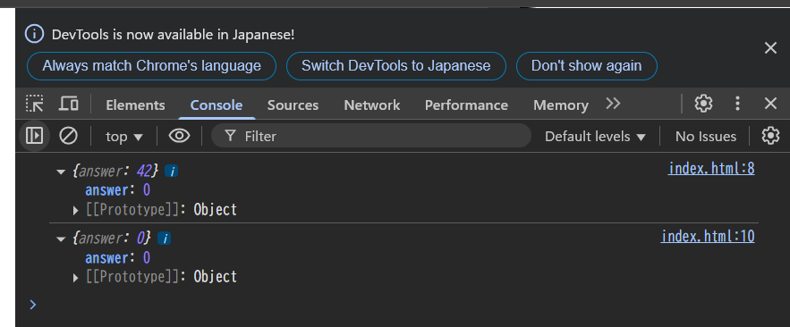
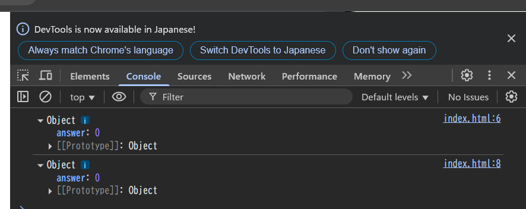
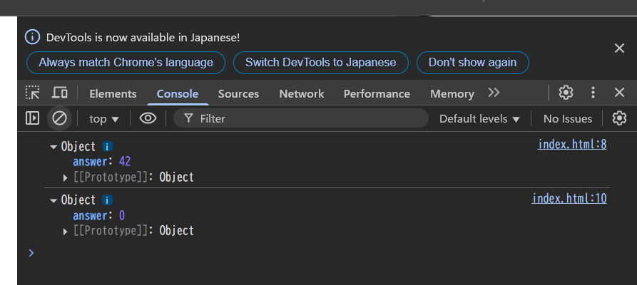

# 問題文のコードの実行結果

1. 開発者ツールを開いた状態のタブで HTML を開く場合

scriptタグ内のJavaScriptがページの読み込みとともに実行される。
answerの値の変化はスナップショット的にconsole.logへ出力されるため、
一度目のconsole.logではanswer=42、二度目のconsole.logではanswer=0となる。



2. HTML を開いた状態のタブで開発者ツールを開く場合

scriptタグ内のJavaScriptの実行は開発者ツールを開いた時点で既に完了している。
console.logはオブジェクト参照なので、二回のconsole.logでは、answer=0の代入が完了した後のlifeオブジェクトを表示する。つまり、二回のconsole.logでは、両方ともanswer=0が出力される。



# コードの修正

## 方法

参照ではなくコピーを出力する。

```html
<!doctype html>
<html>
  <body>
    <script>
      let life = { answer: 42 };
      console.log({ ...life });
      life.answer = 0;
      console.log(life);
    </script>
  </body>
</html>
```

## 結果

一回目はanswer=42、二回目はanswer=0となっている。



**参考**: [console.log の落とし穴：console.log にはオブジェクトの参照が渡るので気を付けよう](https://qiita.com/POPOPON/items/edc7a522d2ee9a50cc3a)
