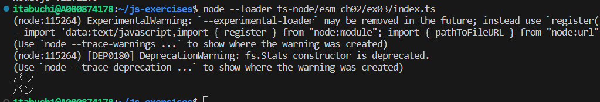

# 実行結果

## NFC

パ (U+30D1) + ン (U+30F3)

## NFD

ハ (U+30CF) + 濁点 (U+309A) + ン (U+30F3)

# Windows と MacOSの文字コード体系の違い

Windowsのファイルシステムでは文字コード体系 「NFC」 を採用しているのに対し、MacOSでは文字コード体系 「NFD」 を採用している。

**参考**: [【VBA】分離した​濁点・半濁点文字を​１文字に​変換する](https://www.skygroup.jp/tech-blog/article/625/)
