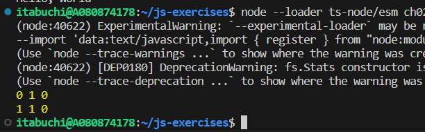

# 実行結果

1. a = 0, b = 0 で初期化される。
2. c = a (= 0)で初期化される。
3. ++ b でbがインクリメントされる。

以上より、a, b, c = 0, 1, 0 と出力される。

4. e = a++ で初期化される。a++は後置インクリメントなので、e の初期化には a のインクリメント前の値が用いられる。よって、e = 0, a = 1となる。
5. b は特に変化しない。
6. a, b, e = 1, 1, 0 と出力される。

