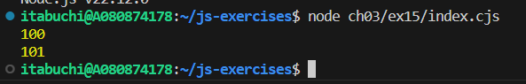

# 実行結果

## let

let で宣言された i はローカル変数なので、for文スコープの i と即時実行関数スコープの i は別の変数である。従って、for文スコープのconsole.logでは、0...9が順番に出力される。
また、for文スコープ外では i は未定義であるため、console.logではエラーが発生する。

## var

var で宣言された変数 i は関数スコープを持つので、for文スコープの i　と即時実行関数スコープの i は別の変数である。従って、for文スコープのconsole.logでは、0...9が順番に出力される。
また、i はブロックスコープは持たないので、for文スコープ外からもアクセス可能である。さらに、for文内の最終ループ終了時に i はインクリメントされている。従って、スコープ外のconsole.logでは、10が出力される。

## let 削除

変数 i はグローバル変数となるため以下のような挙動となる。

1. for文が1ループ目が実行される。=> i = 0
2. 即時実行関数が実行される。=> i = 100
3. console.logが実行される。=> i = 100が出力される。
4. for文1ループ目の終了時点で i がインクリメントされる。=> i = 101
5. for分の2ループ目を実行しようとするが、i = 101なので、ループ実行条件である i < 10 を満たさない。2ループ目は実行されず、for文は終了する。
6. for文スコープ外のconsole.logが実行される。=> i = 101が出力される。

