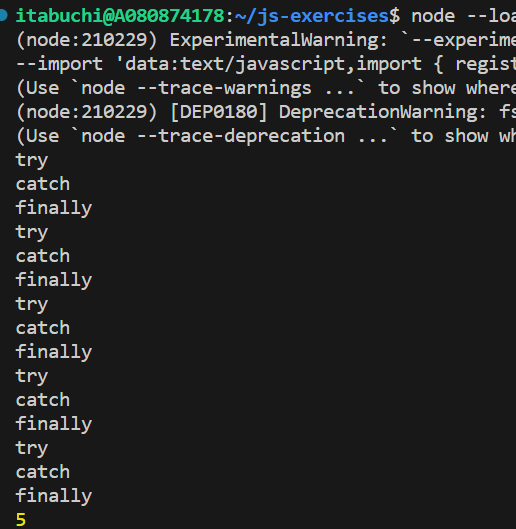
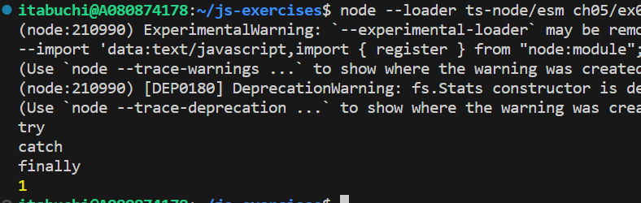

# 予想

（結果）「5」が出力される。

（理由）tryブロックでエラーが発生するのため、catchブロックの「break;」がtry-catch-finallyの暫定的な結果となる。しかし、最後にfinallyブロックの「continue;」が実行されてtry-catch-finallyの結果が上書きされるため、最終的にfor文は中断されない。したがって、「x = i;」はfor文の全ループで実行され、最後に代入された「5」が出力される。

# 実行結果

「5」が出力された。フローも予想通りであった。

また、finallyブロックのcontinue;をコメントアウトすると、for文の1ループ目でcatchブロックのbreak;が実行され、結果は「1」になる。

