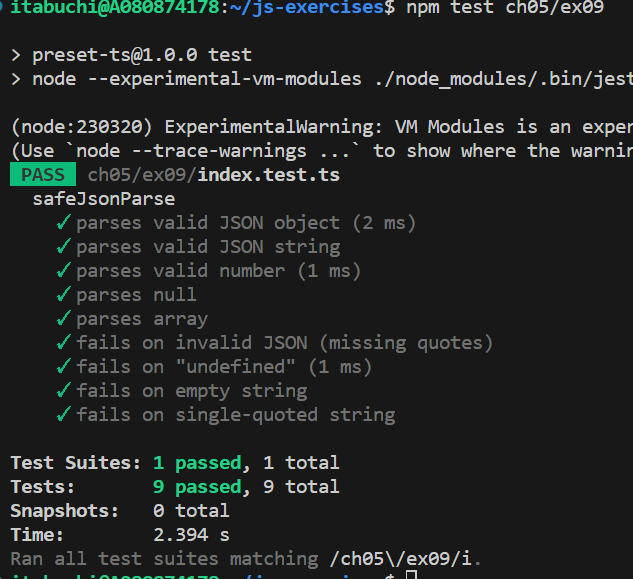

# テスト結果

# JSONパースの可否

## JSON パースできるもの:

1. 文字列

2. 数値

3. 真偽値

4. null

5. オブジェクト（キーはダブルクォートで囲まれた文字列）

   例: {"key": "value"}, {"name": "Alice", "age": 25}

6. 配列: 順序付きの値のリスト（カンマ区切り）

   例: [1, 2, 3], ["apple", "banana"]

## JSON パースできないもの:

1. undefined

2. 関数

3. 日付オブジェクト

   例: {"date": new Date()} は無効

4. コメント

   例: {"key": "value" // "comment"} は無効

5. NaN、Infinity、-Infinity

   例: {"value": NaN} は無効

6. 文字列のクォートエラー: 文字列の開始と終了をダブルクォートで囲まなかった場合。

   例: {name: "Alice"} は無効（キーであるnameがダブルクォートで囲まれていない）
