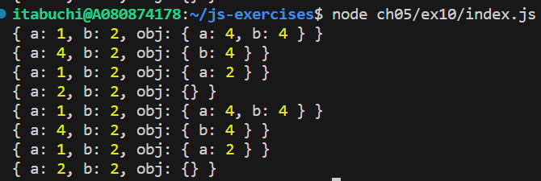

# 実行結果

## パターン1 (obj.aとobj.bが両方とも存在する場合)

withブロックでは、abj.a = obj.bが行われる。

## パターン2 (obj.bのみ存在する場合)

withブロックでは、a = obj.bが行われる。

## パターン3 (obj.aのみ存在する場合)

withブロックでは、abj.a = bが行われる。

## パターン4 (obj.aとobj.bが両方とも存在しない場合)

withブロックでは、a = bが行われる。

