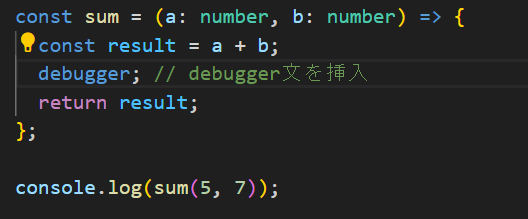
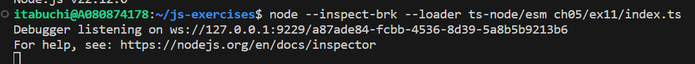
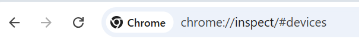
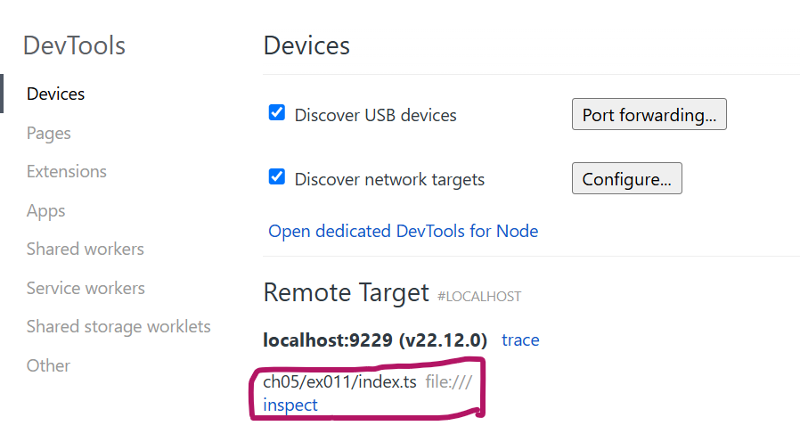
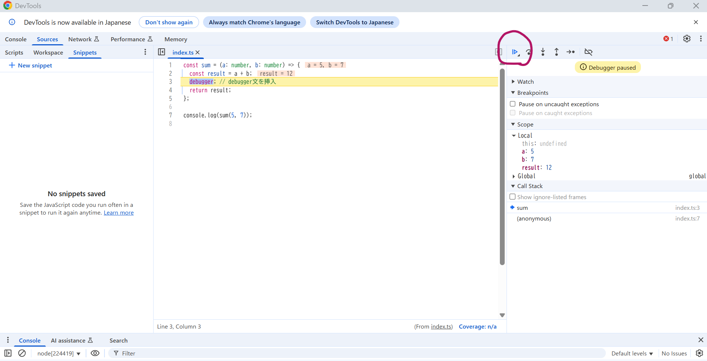

# デバッグ手順

1. デバッグしたい箇所にdebugger文を挿入する。

   

2. 「--inspect-brk」句を加えてnode実行する。

3. 「chrome://inspect」にアクセスする。

4. 「Remote Target」に実行中のファイルが表示されるので、「inspect」を押下する。

5. 右上の実行ボタンを押下すると、debugger文まで処理が進み、途中結果が出力される。

