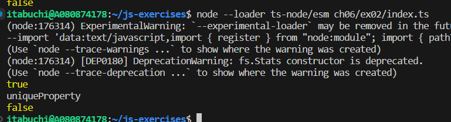

`console.log(Object.getPrototypeOf(child) === parent); // => true`
childはparentをプロトタイプに持つオブジェクトである。

`console.log(child.uniqueProperty); // => "uniqueProperty"`
childもparentのプロパティにアクセスできる。

`console.log(child.hasOwnProperty('uniqueProperty')); // => false`
プロパティ自体はparentのものであって、childのものではない。
