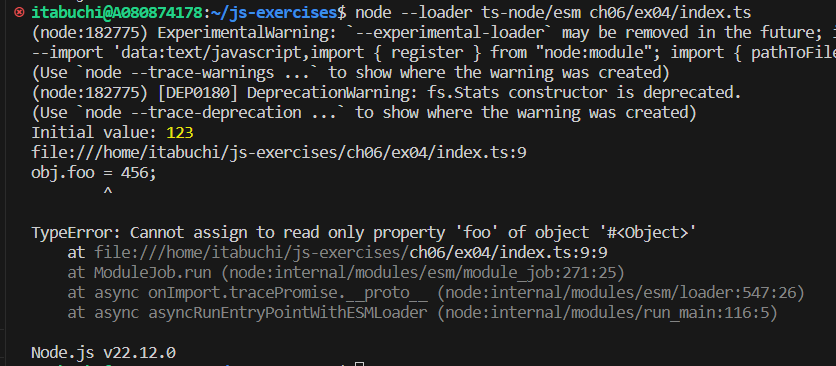
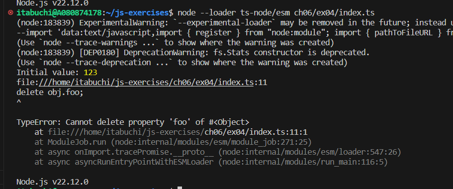
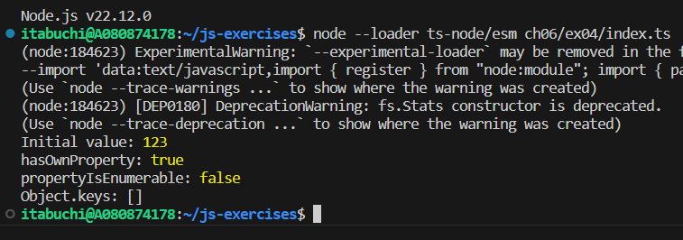

`writable: false`のプロパティに対して書き込みを行うと、エラーが発生する。（strictモード）

`configurable: false`のプロパティに対して削除を行うと、エラーが発生する。（strictモード）

`enumerable: false`のプロパティは列挙できない。

- `hasOwnProperty`でプロパティの存在は確認できる。
- `propertyIsEnumerable`の結果はfalseとなる。
- `Object.keys`でkeyを取り出せない。
- for文で無視される。

