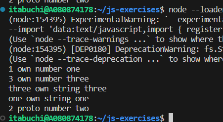

1. プロパティ名が数値である自身のプロパティが数値の昇順で表示される。（今回は数値の降順にプロパティを追加したが、昇順ソートされていた。）
2. プロパティ名が文字列である自身のプロパティは追加順で表示される。（今回は文字列の降順にプロパティを追加したが、特にソートはされていなかった。）
3. プロトタイプのプロパティが表示される。（ただし、プロトタイプと同名かつ列挙可能なプロパティが存在するプロパティは、列挙されない。）
