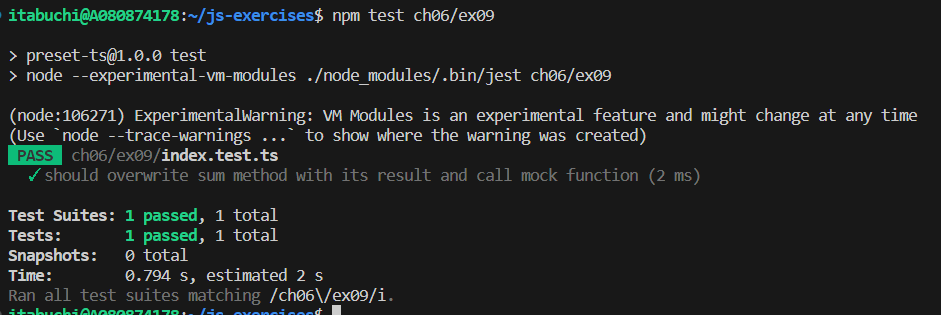

# 結果

# 参考

`JSON.stringify()`は、オブジェクトに`toJSON()`を定義することで、シリアライズの挙動をオーバーライドできる。

https://developer.mozilla.org/ja/docs/Web/JavaScript/Reference/Global_Objects/JSON/stringify#tojson_%E3%81%AE%E6%8C%99%E5%8B%95
