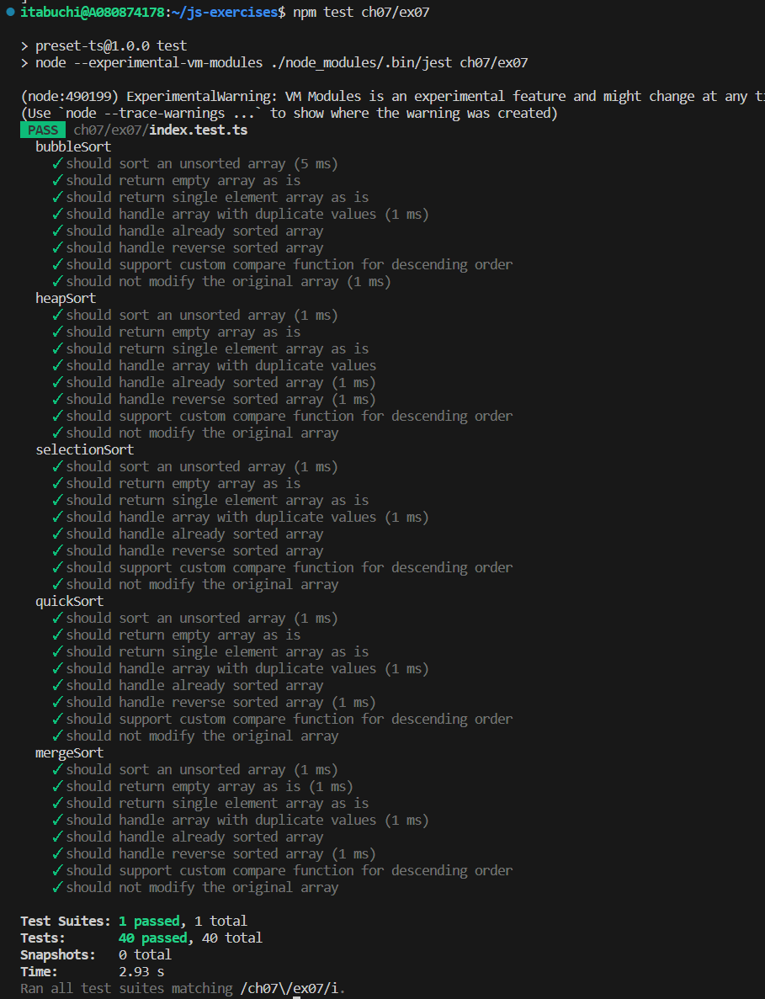
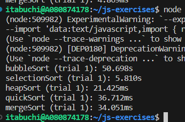

# テスト結果



# アルゴリズム

## バブルソート

### 計算量

```
O(n^2)
```

### 概要

隣り合う要素の大小を比較しながら整列させる。

https://ja.wikipedia.org/wiki/%E3%83%90%E3%83%96%E3%83%AB%E3%82%BD%E3%83%BC%E3%83%88

## 選択ソート

### 計算量

```
O(n^2)
```

### 概要

配列から最小値を探し、配列の先頭要素と入れ替えていくことで並べ替える。

https://ja.wikipedia.org/wiki/%E9%81%B8%E6%8A%9E%E3%82%BD%E3%83%BC%E3%83%88

## ヒープソート

### 計算量

```
O(n log(n))
```

### 概要

リストの並べ替えを[二分ヒープ木](https://ja.wikipedia.org/wiki/%E4%BA%8C%E5%88%86%E3%83%92%E3%83%BC%E3%83%97)を用いて行う。

https://ja.wikipedia.org/wiki/%E3%83%92%E3%83%BC%E3%83%97%E3%82%BD%E3%83%BC%E3%83%88

## マージソート

### 計算量

```
O(n log(n))
```

### 概要

既に整列してある複数個の列を1個の列にマージする際に、小さいものから先に新しい列に並べれば、新しい列も整列されている、というボトムアップの分割統治法による。大きい列を多数の列に分割し、そのそれぞれをマージする作業は並列化できる。

https://ja.wikipedia.org/wiki/%E3%83%9E%E3%83%BC%E3%82%B8%E3%82%BD%E3%83%BC%E3%83%88

## クイックソート

#### 計算量

```
平均計算量：O(n log(n))
最悪計算量：O(n^2)
```

#### 概要

与えられたデータ列を基準値を用いて大小順に分割し、分割されたそれぞれの部分に対して同じ手順を繰り返すことでソートを行う。

https://ja.wikipedia.org/wiki/%E3%82%AF%E3%82%A4%E3%83%83%E3%82%AF%E3%82%BD%E3%83%BC%E3%83%88

# 実行時間測定

実装したソートアルゴリズムの実行時間比がオーダー通りになるのか実験した。

## 配列サイズ

n = 10,0000

## 結果



## 考察

n = 10,0000なので、

```
n log(n) ≒ 1,660,964
n^2 = 100,000,000<br>

n^2 / n log(n) ≒ 6,020
```

ベンチマークの実行結果を見ると、O(n log(n))系アルゴリズムはO(n^2)系アルゴリズム（バブルソート）の約1/1000程度の実行時間となっており、明らかに高速であることがわかる。

一方で、同じO(n^2)アルゴリズムでも、選択ソートはバブルソートより10倍程度速い。
これは、比較回数は両社ともO(n^2)であるが、スワップ回数がバブルソートがO(n^2)回、選択ソートはO(n)回であるためと考えられる。
