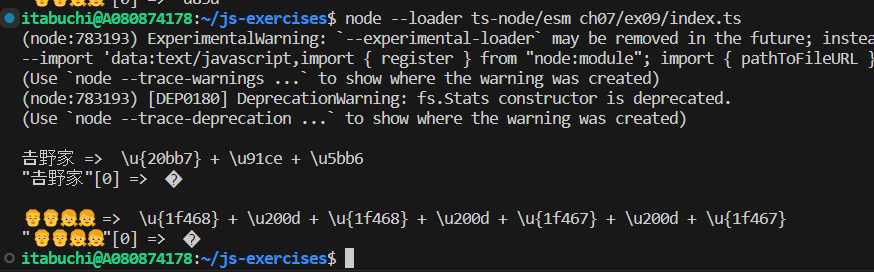

# 結果

1.  `𠮷`という文字はサロゲートペア"\u{20bb7}"で表現される。

これは、"\uD842 + \uDCB7"なので、`"𠮷野家"[0]`は、\uD842を表す。

そのため、console.logで出力すると、サロゲートペアの前半のみが出力され、文字化けする。

2.  `👨‍👨‍👧‍👧`という絵文字は、4つの絵文字をゼロ幅接合子で接合している（u{1f468} + \u200d + \u{1f468} + \u200d + \u{1f467} + \u200d + \u{1f467}）。

また、先頭のu{1f468}は、"\uD83D + \uDC68"のサロゲートペアなので、`"👨‍👨‍👧‍👧"[0]`は"\uD83D"を表す。

そのため、console.logで出力すると、サロゲートペアの前半のみが出力され、文字化けする。

