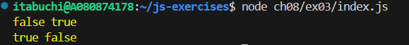

# 実行結果の予想

## nest.nm():

nm は通常の関数として定義されているため、this は呼び出し元のオブジェクトである nest を指す。
そのため、false true（this !== obj かつ this === nest）となる。

## nest.arrow():

arrow はアロー関数として定義されているため、this はアロー関数が定義されたスコープの this を継承する。
アロー関数は om メソッド内で定義されているため、this は obj を指す。
そのため、 true false（this === obj かつ this !== nest）

# 結果

