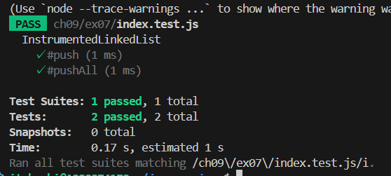

# 問題点

<!--
InstrumentedLinkedList は LinkedList を継承するが、pushAll メソッド内で super.pushAll を呼び出すと、LinkedList の pushAll メソッドが直接呼びだされる。ここで、このメソッドは push を呼び出すが、InstrumentedLinkedList の push ではなく、LinkedList の push が呼び出されるため、#pushCount が正しく更新されない。 -->

<!-- 上記は間違い -->

親と子の両方のpushが呼ばれるので、countが期待値の2倍になる。

# 修正点

継承の代わりに、InstrumentedLinkedList 内で LinkedList をプロパティとして保持し、必要な操作を委譲する形に修正した。

# 修正後のテスト結果

