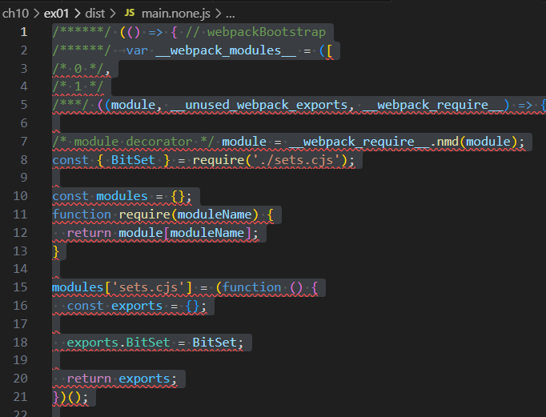
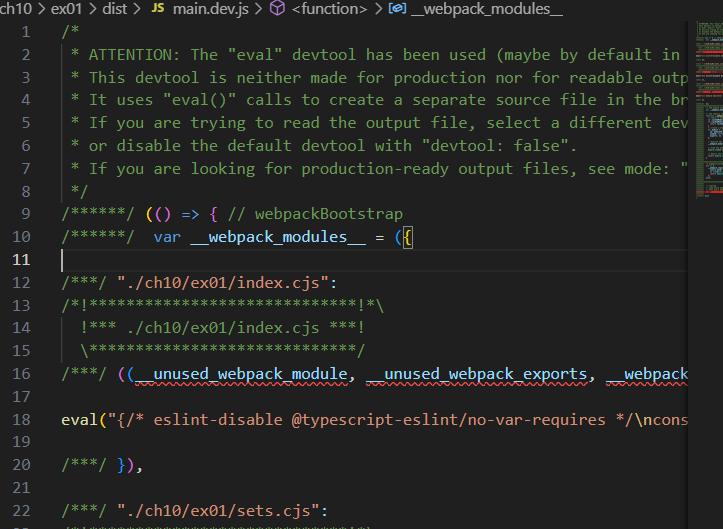
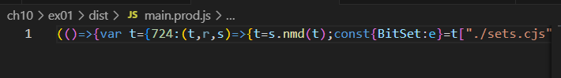

## --mode=none

バンドルはほぼ元のソースコードの形を保持している。関数や変数名も変更されず、可読性が高い。ファイルサイズは6KB。(index.cjsとstats.cjsが1KB、sets.cjsが4KBなので、その合計とおよそ同じ。)

## --mode=development

eval() でモジュールがラップされている。元のコードがブラウザでデバッグ可能になり、可読性は少し低下する。ファイルサイズは3つのmodeで最大の8KB。

## --mode=production

production
変数名や関数名を短縮・圧縮し、不要な空白やコメントも削除されている。全てのコードが1行に圧縮されて可読性はほぼなくなる。ファイルサイズは3つのmodeで最小の3KB。
