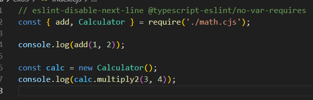

# 関数名とクラス名のリファクタ

関数`add`を`add2`、クラス`Calculator`を`Calculator2`、メソッド`multiply`を`multiply2`に変更した。

# Nodeのモジュール

インポート側のindex.cjsでは、関数名とクラス名は変更されないが、クラスのメソッド名は変更される。

（変更前 index.cjs）

（変更後 index.cjs）

# ES6のモジュール

## index.ts

インポート側のindex.tsでは、関数名、クラス名、メソッド名全てが変更される。名前付きインポートの場合は、名前部分は変わらない。一方で、再エクスポートの際は名前付きエクスポートに変更される。

（変更前 index.ts）

（変更後 index.ts）

## index2.ts

デフォルトエクスポートされた`add`は、再エクスポート時に`default as add`のように、関数名が名前となるような名前付きエクスポートがされていた。この名前部分の変更はindex2.tsのインポートには反映されないため、`add`のインポートは名前不一致のエラーが発生する。

（変更前 index2.ts）

（変更後 index2.ts）

