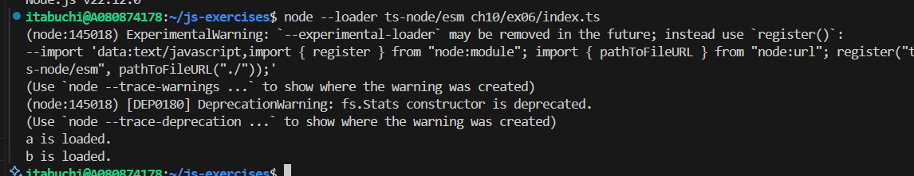

# 予想

エクスポートしないJSファイルをimportすると、そのファイル内のトップレベルのコードが1回だけ実行される。

また、同じファイルを複数回importしても再評価はされず、既存のモジュールがキャッシュとして使われるため、トップレベルコードは最初の1回だけ実行される。

以上より、

```js
import './a.js';
import './b.js';
import './a.js';
```

というimportを行ったとき、

```js
'a is loaded.';
'b is loaded.';
```

という出力になる。

# 結果


