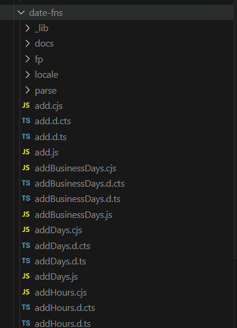

# date-fns

主要な関数モジュールはルート直下に配置され、個々の関数がファイル単位で管理されている。ユーティリティ関数は`_lib`ディレクトリ（内部向け。これを直接ユーザーが呼び出すことはない。）、ロケールに関するコードは`locale/`ディレクトリにまとめられている。

必要な関数だけをインポートして使用できるため、Tree Shakingに強く、バンドルサイズを小さくすることが可能である。

# Luxon

`src`ディレクトリ直下に、`DateTime`、`Duration`、`Interval`など主要クラスのファイルが配置されている。
日付を扱う機能をオブジェクト指向ベースで提供され、各クラスにユーティリティ関数やメソッドが集約されている。

モジュールはクラス単位で整理されており、用途に応じて必要なクラスのみをインポートできる。

# Day.js

ロケールに関するコードは`locale/`、プラグインは`/plugin`に整理されている。
ユーザーは必要なプラグインだけを`dayjs.extend(...)`で動的に取り込むことができ、コア部分を極力小さく保たれている。

個の設計により、ライブラリの軽量性を維持しつつ、拡張性も確保されている。

