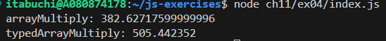
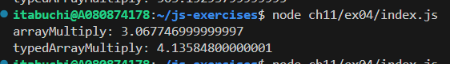
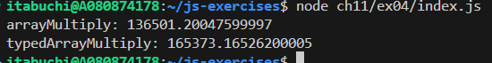
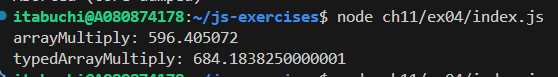
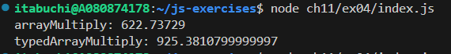

# 予想

[N, K, M]に依らず、常にTypedArrayの方が速い。理由は、TypedArrayはメモリを連続して確保するため、CPUキャッシュ効率が高いためである。

# 結果

[N, K, M]を変更して試行したが、いずれの場合でもTypedMapの方が遅くなった。
各値は10 ~ 1,000のオーダーで試行したが、配列のサイズが小さすぎてメモリ効率による最適化の恩恵が薄く、他の要因でArrayのJIT最適化に負けている？

## [N, K, M] = [100, 200, 300]のとき

## [N, K, M] = [10, 20, 30]のとき

## [N, K, M] = [1000, 1000, 1000]のとき

## [N, K, M] = [1000, 2000, 3000]のとき

## 他のTypeArrayの場合

Uint32Arrayを使用し、[N, K, M] = [10, 20, 30]で実行した場合もTypedArrayの方が低速であった。

