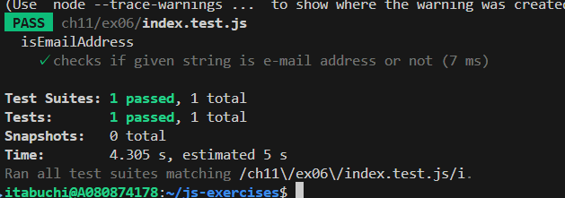
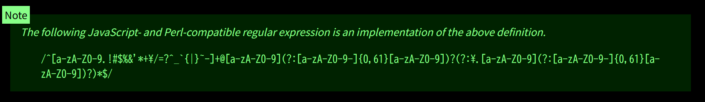

# テスト結果

# メールアドレスの正規表現

<!-- /^[a-zA-Z0-9.!#$%&'*+\/=?^_`{|}~-]+@[a-zA-Z0-9](?:[a-zA-Z0-9-]{0,61}[a-zA-Z0-9])?(?:\.[a-zA-Z0-9](?:[a-zA-Z0-9-]{0,61}[a-zA-Z0-9])?)*$/ -->

WHATWG（Web Hypertext Application Technology Working Groupの略。Web技術の標準仕様の検討や策定を行う業界団体）が記載しているメールアドレスの正規表現。

ローカル部：英数字と許可された特殊文字。

ドメイン部：英数字またはハイフンを使用した63文字以内の文字列（ただし、先頭と末尾のハイフン使用は不可）をドット区切りで繰り返したもの。

先頭、末尾、連続ドットの使用や、文字数超過は検出できない。

# 参考

https://zenn.dev/igz0/articles/email-validation-regex-best-practices
https://html.spec.whatwg.org/multipage/input.html#email-state-(type=email)
