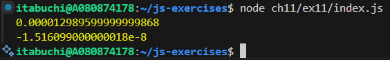

# 結果

# 理由

JITコンパイラによる最適化によって、マイクロベンチマークの処理時間を正確に計測することは困難になった。JITコンパイラでは以下の最適化が行われる。

1. Loop-Invariant Code Motion (LICM)
   `str.length`のように、ループ内で結果が不変の式をループ外に移動する最適化。
2. Constant Propagation
   定数式をコンパイル時に評価して置き換える最適化。
3. Dead Code Elimination (DCE)
   計算結果が使用されない場合は、コード自体を排除する最適化。

結果として、`N`が小さい場合はJITによる最適化が行われないため、`costOfLengthPlusLoop`はの方がループ内での処理が発生する分、`costOfLoop`よりは実行時間が長くなり、計測値は正の値になる。

しかし、`N`が大きくなると、JITの最適化によって、実行結果が変わらない`res = str.length`の計算はループ外に移動され、ループ処理自体が省略される。その結果、逆に`costOfLoop`の方が、内部でカウンタ増加などのオーバーヘッドを持つ分、実行時間が長くなり、差 (lhs - rhs) がマイナスになることがある。
