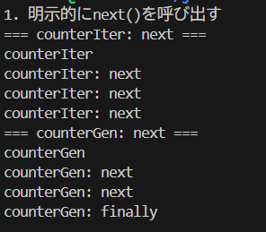

調査対象の操作

# 明示的に[イテレータプロトコル](https://developer.mozilla.org/ja/docs/Web/JavaScript/Reference/Iteration_protocols)の next() を呼び出す

イテレータでは next() を呼ぶたびに counterIter: next が表示される。終了後は done: true を返すが、finally はない。

ジェネレータでは next() を呼ぶたびに yield 部分の処理が実行され、ループ終了後 finally ブロックが実行される。

# 明示的に[イテレータプロトコル](https://developer.mozilla.org/ja/docs/Web/JavaScript/Reference/Iteration_protocols)の return() を呼び出す

イテレータは return() を呼ぶと return メソッドが実行される。

ジェネレータは finally ブロックが実行される。return で yield は終了する。

# 明示的に[イテレータプロトコル](https://developer.mozilla.org/ja/docs/Web/JavaScript/Reference/Iteration_protocols)の throw() を呼び出す

イテレータでは throw() が呼ばれると throw メソッドの内容が実行される。

ジェネレータでは catch ブロックに入り、finally が実行される。

# for-of ループを実行

for-of は自動で Symbol.iterator を呼ぶ。

ループ終了後、ジェネレータでは finally が実行される。

# for-of ループを実行途中で break

for-of で途中 break すると、イテレータの場合 return() が自動呼び出しされる。

ジェネレータでは finally ブロックが実行される。

# for-of ループを実行中に例外発生

for-of で途中 break した場合と同様に、イテレータの場合 return() が自動呼び出しされる。

ジェネレータでは finally ブロックが実行される。
