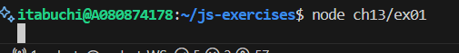

# 予想

最初に無限ループとなる`longRunningFunction`が実行されるが、1秒後にタイムアウトコールバックのログ出力が並列実行される。

# 結果

何も表示されない

# 理由

JavaScriptのプログラムやコールバック関数などは、タスクキューに順番に追加されて古いものから順に実行される。
メインタスク > マイクロタスク > タイムアウトコールバック の順に全てのキューを処理してから次のカテゴリのタスクが実行されるので、メインタスクである`longRunningFunction`が終了しない限り、タイムアウトコールバックは呼ばれないため。

実際に、`setTimeout`の設定時間を0秒に変更して実行しても`longRunningFunction`が先にコールされた。
