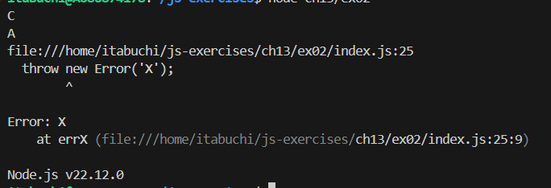

# f3

## 予想

try/catchでは同期処理しかcatchできないため、Promise内のエラーはcatchされない。
finallyブロックは同期的に実行されるので 初めにlogCが実行される。
次に、0秒後にAが出力される。
その後errXで例外が発生する。

## 結果

# f4

## 予想

2秒後にAが出力される。
その1秒後にBが出力される。
さらに2回目のthenの戻り値100が渡り、100が出力される。

## 結果

# f5

## 予想

f4と違い、then()に関数ではなくPromiseを渡しているため、wait2とwait1は並行して実行される。
そのため、1秒後にBが出力される。
その1秒後（関数の処理開始から2秒後）に、Aが出力される。
さらにその後、thenに40が渡され、40が出力される。

## 結果

# f6

## 予想

1秒後にAが出力される。
pに対する二つのthenは並行して実行されるので、さらに1秒後にBが出力される。
Bが出力された1秒後（Aが出力された2秒後）にCが出力される。

## 結果

# f7

## 予想

1秒後にAが出力される。
wait1とwait2は並行して実行されるので、さらに1秒後にwait2が解決する。
このとき、pはすでに解決済みなのですぐにB、続いてCが出力される。

## 結果

# f8

1秒後に、errXで発生した例外がcatchで捕捉され、throwされたエラーのメッセージであるXが出力される。
直後にAが出力される。

## 予想

## 結果

# f9

## 予想

1回目のthenは特になにも起こらない。
1秒後にerrYで発生した例外がcatchで捕捉され、throwされたエラーのメッセージであるYが出力される。
直後にAが出力される。

## 結果

# f10

## 予想

`then(() => 42)`は成功扱いとなり、次のthenのerrYが呼ばれる。
errYはハンドリングされていないため、先にfinallyが処理され、Aが出力される。
その後、エラーYが出力される。

## 結果

# f11

new PromiseでerrXがthrowされ、それがcatchされてログXが出力される。

## 結果

# f12

## 予想

Promise内のsetTimeoutは非同期コールバックなので、
その中で例外をthrowしてもPromiseのcatchでは捕捉できない。
従って、未ハンドリングのエラーXが発生する。

## 結果

