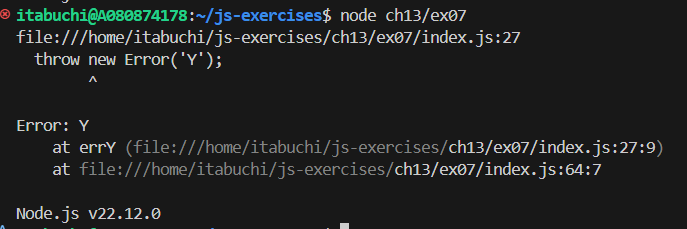

# h1

## 予想

3秒後にAが出力される。
その2秒後にBが出力される。
その1秒後にCが出力される。

## 結果

# h2

## 予想

new PromiseでerrXがthrowされ、それがcatchされてログXが出力される。

## 結果

# h3

## 予想

async関数は自動的にPromiseを返す。async内部で例外が発生しても、外側のPromiseではその例外を捕捉できないため、未ハンドリングのエラーXが発生する。

## 結果

# h4

## 予想

p1, p2はasync関数ではなく、Promiseを代入しているだけなので、awaitは「Promiseの完了を待つ」だけで「Promiseの開始を遅らせる」ことはできない。
よって、p1とp2はほぼ同時に開始される。
1秒後にwait1が解決し、errYが実行される。
しかし、p1がまだawait中であるため、p2で発生した例外をcatchすることはできない。
従って、errYが未処理例外として表示される。

## 結果

