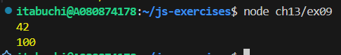
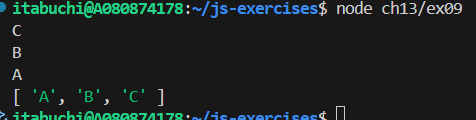
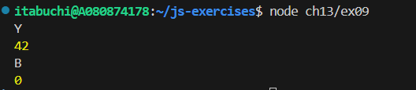
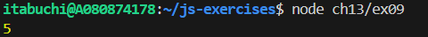
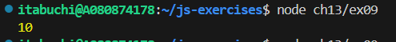

# i1

## 予想

Promise.anyは最初に成功したPromiseの値を返す。
最初に成功するのは、wait1なので、1秒待機後に42が返される。
ただし、このときwait2も実行はされている。
一つ目のlog(v)で42が表示される。
単独のwait2が実行されて2秒待機する。
この間に、Promise.anyのwait2が解決し、vに100が代入される。
単独のwait2の待機が終わり、二つ目のlog(v)で100が表示される。

```mermaid
gantt
  title i1
  dateFormat  s
  axisFormat |
    wait1  :w1any, 0, 1s
    wait2  :w2any, 0, 2s
    v=100  :v100, after w2any, 0.2s
    log42  :l42, after w1any, 0.2s
    wait2  :w2, after l42, 2s
    log100  :l100, after w2, 0.2s
```

## 結果

# i2

## 予想

Promise.allは全てのpromiseを並列実行し、全て完了してから結果を返す。
wait1, wait2, wait3は待機時間の短い順に解決されるため、C, B, Aの順に1秒おきに表示される。
最後に、全ての処理結果を格納した配列vが返る。
配列vの要素の並びは定義順なので、[A,B,C]が返る。

```mermaid
gantt
  title i2
  dateFormat  s
  axisFormat |
    wait3  :w3, 0, 3s
    wait2  :w2, 0, 2s
    wait1  :w1, 0, 1s
    log[A, B, C]  :lABC, after w3, 0.2s
```

## 結果

# i3

## 予想

Promise.allは全てのpromiseを並列実行し、一つでもエラーが発生すれば即座にrejectされる。
wait1, wait2, wait3は待機時間の短い順に解決されるため、初めにerrYが発生する。
Promise.allは即座にrejectされ、エラーがcatchされ、log(e.message)でYが、log(v)で42が表示される。
ただし、Promise.all内の他の処理は継続されているため、関数実行開始の2秒後にはBが出力され、3秒後にはvに0が代入され、errXが発生する。
ただし、Promise.all自体は既にrejectされているため、errXは未処理例外としてcatchされない。
よって、最後に単独のwait3で3秒待機した後、log(v)で0が表示されて処理は終了する。

```mermaid
gantt
  title i3
  dateFormat  s
  axisFormat |
    wait3  :w3all, 0, 3s
    v=0    :v0, after w3all, 0.2s
    wait2  :w2all, 0, 2s
    logB  :lB, after w2all, 0.2s
    wait1  :w1all, 0, 1s
    logY  :lY, after w1all, 0.2s
    log42  :l42, after lY, 0.2s
    wait3  :w3, after l42, 3s
    log0  :l0, after w3, 0.2s
```

## 結果

# i4

## 予想

p1とp2は同時に開始される。
p1は最初に1秒の待機時間があるので、p2のnextに1が代入される。
p2が2秒待機している間に、p1のnextに1が代入される。
p2でvにnextの1が代入される。
以下同様にして、p1とp2からvに、1秒ずつずれながら同じ値が代入されるため、最終的な結果は5となり、11秒後に5が出力される。

```mermaid
gantt
    title i4
    dateFormat  s
    axisFormat |
    p1-wait1        :p1_0, 0, 1
    p2-loop1        :p2_1, 0, 2
    p1-loop1        :p1_1, after p1_0, 2s
    p2-loop2        :p2_2, after p2_1, 2s
    p1-loop2        :p1_2, after p1_1, 2s
    p2-loop3        :p2_3, after p2_2, 2s
    p1-loop3        :p1_3, after p1_2, 2s
    p2-loop4        :p2_4, after p2_3, 2s
    p1-loop4        :p1_4, after p1_3, 2s
    p2-loop5        :p2_5, after p2_4, 2s
    p1-loop5        :p1_5, after p1_4, 2s
    log5           :vlog, after p1_5, 0.2s
```

## 結果

## 出力値を10にする方法

`await Promise.all([p1(), p2()]);`を`await p1(); await p2();`に変更する。

## 結果

