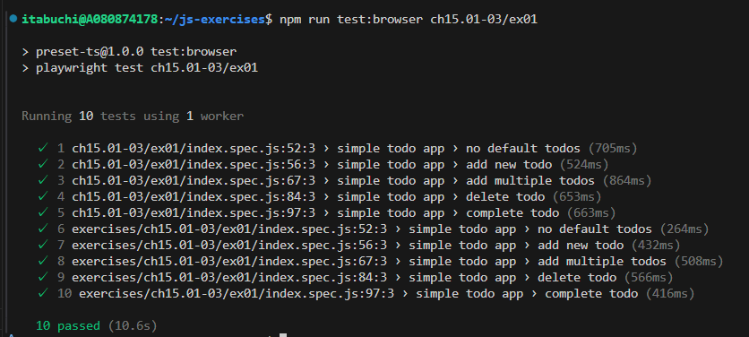

1. テスト結果
   

2. index.html ファイル内の script タグから `type="module"` 属性を削除した場合、期待通り動作させるにはどうすべきか答えなさい。

type="module" なしにすると、ES モジュールとして扱われず、import/export が使えない状態になるため、index.js 内で import/export を使っている場合は、全て削除するか、または IIFE に書き換えて通常のスクリプトにする必要がある。
