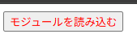

# ファイル構成

- `index.html`...「モジュールを読み込む」ボタンを表示する。
- `index.js`...ボタンを押下したときの処理として、`jquery-git.module.min.js`を動的インポートで読み込む。

# 動作確認

1.  `npx serve ./ch15.01-03/ex02`を実行し、localhost:3000を起動する。

2.  localhost:3000にアクセスすると、黒字の「モジュールを読み込む」ボタンが表示される。
    

3.  「モジュールを読み込む」ボタンを押下すると、ボタンの文字が赤色に変化する。
    
