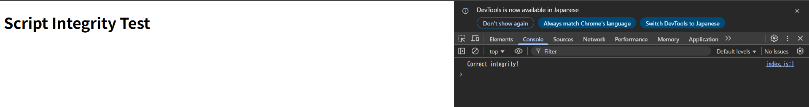
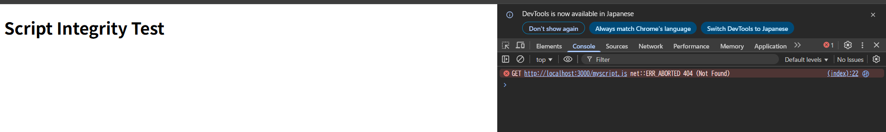

# 動作確認

1. `openssl dgst -sha256 -binary ch15.01-03/ex03/index.js | openssl base64 -A`で`index.js`のハッシュ値を計算する。

   - `dgst`: ダイジェスト(ハッシュ)計算コマンド (16進数で出力される)
   - `-binary`: ハッシュ値をバイナリに変換
   - `base64`: ハッシュ値をBase64に変換

2. ターミナルに表示されたハッシュ値を`integrity="sha256-<<ここにハッシュ値を貼り付け>>"`にコピペする。
3. localhost:3000にアクセスし、開発者ツールを開く。
   - ハッシュ値が正しい場合: スクリプトがロードされる。
     
   - ハッシュ値が誤っている場合: スクリプトがロードされない。
     

# integrity属性で防御できる攻撃

integrity属性によって、ハッシュ値を使用してスクリプトの真正性が検証されるため、スクリプトの改竄による攻撃を防御できる。

1. XSS (クロスサイトスクリプティング)
   攻撃者がHTMLを書き換えて外部スクリプトを挿入するケース
2. MITM (Man-In-The-Middle, 中間者攻撃)
   公衆Wi-Fiやプロキシを通じて通信途中でスクリプトが書き換えられるケース
3. 配布されたスクリプトが第三者によって書き換えられていた場合
   CDNやサーバーが攻撃されてスクリプトが改竄されるケース
   Amazon CloudFrontなどが代表的なCDN

4. サプライチェーン攻撃
