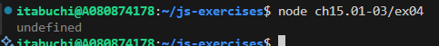

# グローバルオブジェクトを参照する方法

1. ブラウザ環境
   `window`
2. Node.js環境
   `global`
3. 共通
   `globalThis`

# ブラウザ独自のグルーバルオブジェクトのプロパティ・メソッド

1. ブラウザ独自プロパティ
   `document`: DOM ツリー（HTML文書）へのアクセス
   `navigator`: ブラウザ情報、OS 情報、ユーザーエージェントなど
   `location`: 現在の URL 情報の取得・変更
   `history`: ブラウザ履歴の操作（戻る、進む）
   `screen`: 画面サイズ・解像度などディスプレイ情報
   `localStorage`: 永続的なクライアント側ストレージ
   `sessionStorage`: セッション単位のクライアント側ストレージ

2. ブラウザ独自メソッド
   `alert(message)`: ダイアログでメッセージを表示
   `confirm(message)`: OK/キャンセルの確認ダイアログ
   `prompt(message, default)`: 入力ダイアログを表示し値を取得
   `fetch(url, options)`: HTTP リクエストを送信する Promise ベース API
   `open(url, name, specs)`: 新しいブラウザウィンドウ・タブを開く
   `setTimeout(func, ms)`: 指定時間後に関数を実行
   `setInterval(func, ms)`: 指定間隔で関数を繰り返し実行
   `requestAnimationFrame(callback)`: 次のブラウザ描画タイミングでコールバックを実行

# グローバルオブジェクトのundefined

## グローバルオブジェクトにundefinedが定義されてることの確認

`console.log(globalThis.undefined);` を実行すると、`undefined`が出力される。

## 過去のES仕様で発生していた問題

ES3以前では`undefined`は書き換え可能な変数であったため、変数が未定義かどうかの判定が信頼できないという問題があった。(代用として、`void 0`などが使用されていた。)
ES5以降では`undefined`は読み取り専用になり、書き換え不可になった。

# 参考

https://developer.mozilla.org/ja/docs/Glossary/Global_object
https://qiita.com/kohki_takatama/items/5f1c6f75e6bbf6553682
