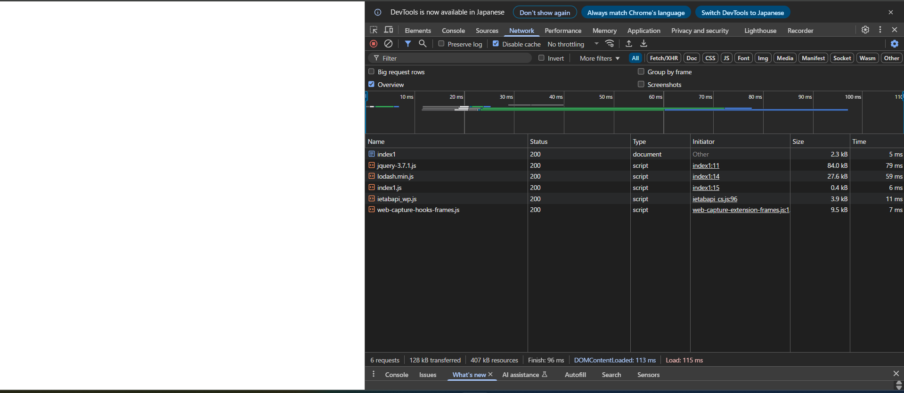
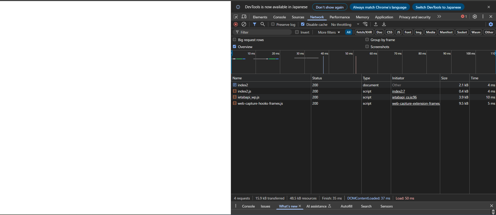
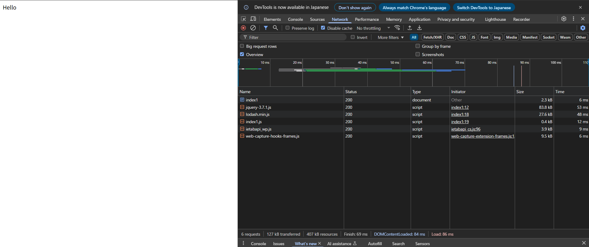
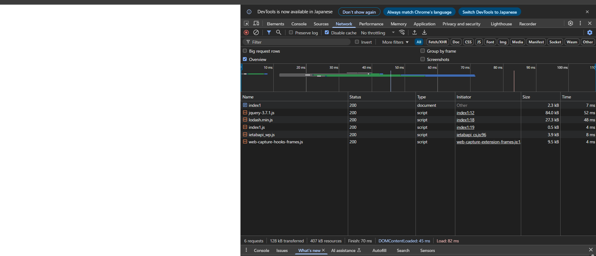
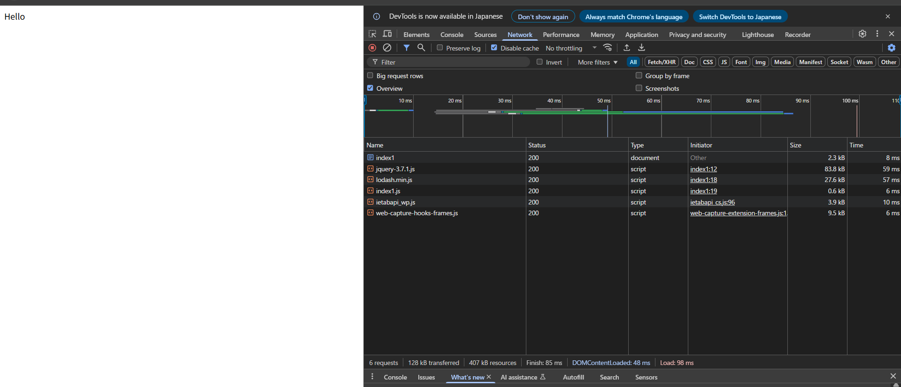
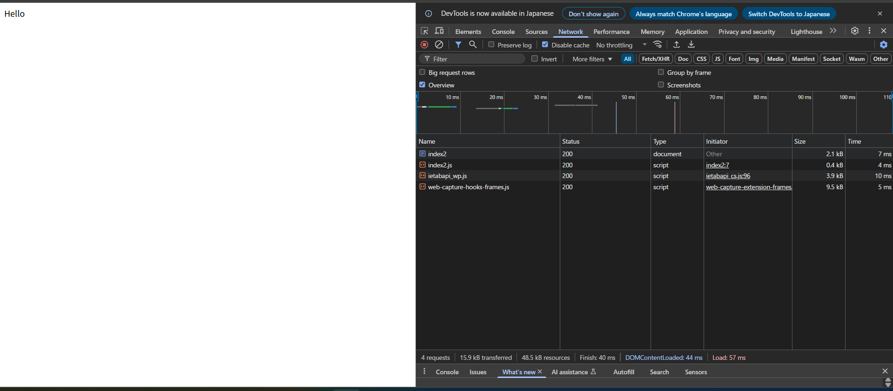
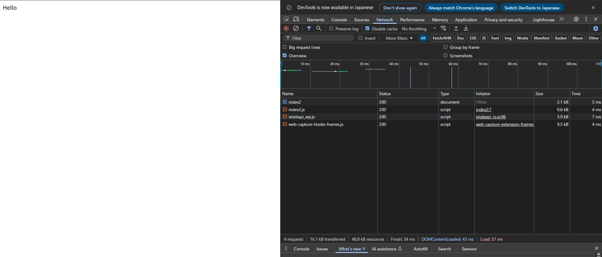

# 修正前ロード時間計測

## index1

115 ms

Helloが表示されない。

`$("div#1000").html(_.capitalize("hello"));`では以下の処理が行われている。

- `$() …`: jQueryで DOM 要素を取得
- `"div#1000" …`: `
` を指定
- `.html("...") …`: jQueryで、innerHTML に値を代入
- `\_.capitalize("hello") …`: lodash の関数で "Hello" に変換

しかし、`<script>` は HTML 解析をブロックしてその場で実行されるため、body の後半にある`id=1000` の `
` がまだDOM上に構築されていない状態で実行される。

そのため、`$("div#1000")` は null になり、Hello が表示されない。

## index2

50ms

index1と同様の理由で、Helloが表示されない。

# 修正後ロード時間計測

## index1

ロード時間が最速かつ、実行順序も保証されるのは、「script タグに defer="true"を付与」を行った場合である。

1.  script タグに async="true"を付与

    86 ms

    `async` はスクリプトのダウンロードを並列実行するため、ロード時間が高速化される。しかし、スクリプトの実行はDOMの構築完了を待たないため、Hello は表示されない。

    

2.  script タグに defer="true"を付与

    86 ms

    `defer` はスクリプトのダウンロードを並列実行するため、ロード時間が高速化される。また、スクリプトの実行はDOMの構築完了を待つため、Hello が表示される。

    

3.  js 内の処理を document.addEventListener("domcontentloaded", () => {})で囲む

    82 ms

    `DOMContentLoaded`はDOMの構築を待ってスクリプトが実行されることを保証するコードであり、`async`と併用することが有効だと考えられるため、`async + DOMContentLoaded`で計測を行った。しかし、結果は Hello が表示されなかった。

    理由: `index1.js`内で`jQuery`と`lodash`を使用しているため、`jQuery → lodash → index1.js`の順でスクリプトが実行される必要がある。しかし、`async`はスクリプトをダウンロード完了順に実行するため、`jQuery → lodash → index1.js`の順にスクリプトが実行されなかったため Hello が表示されなかったと考えられる。

    

4.  js 内の処理を window.addEventListener("load", () => {})で囲む

    98 ms

    `load`は全リソースのロードを待ってスクリプトを実行するコードであるため、`async + load`で計測を行ったところ、結果は Hello が表示された。

    ただし、全てのリソースのダウンロード完了を待ってからスクリプトが実行されるため、このコードを入れた時点でロード時間は最速でなくなる。

    

## index2

ロード時間が最速となるのは、「script タグに defer="true"を付与」を行った場合、または、「script タグに async="true"を付与」を行い、かつ「js 内の処理を document.addEventListener("domcontentloaded", () => {})で囲む」を行った場合である。

ただし、スクリプト実行がDOM構築完了を待つ分、修正前よりはロード時間が長くなる。

1.  script タグに async="true"を付与

    `async` はスクリプトのダウンロードを並列実行するが、今回はスクリプトが1件しかないためダウンロード速度は変わらない。

2.  script タグに defer="true"を付与

    57 ms

    `defer` はスクリプトのダウンロードを並列実行するが、今回はスクリプトが1件しかないためダウンロード速度は変わらない。また、スクリプトの実行はDOMの構築完了を待つため、Hello が表示される。

    

3.  js 内の処理を document.addEventListener("domcontentloaded", () => {})で囲む

    54 ms

    `async + DOMContentLoaded`で計測を行ったところ、Hello が表示された。`DOMContentLoaded`はDOMの構築を待ってスクリプトが実行されることを保証するコードなので、今回のようにスクリプトが1件であれば、スクリプトの実行順を保証しない`async`と併用することができる。ただし、特にロード速度が`defer`より速くなるわけではない。

    

4.  js 内の処理を window.addEventListener("load", () => {})で囲む

    57 ms

    `async + load`で計測を行ったところ、Hello が表示された。`load`は全リソースのロードを待ってスクリプトを実行するコードであるが、今回はスクリプトが1件しかないためロード時間は遅くならない。

    
