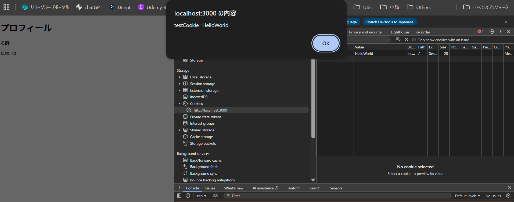
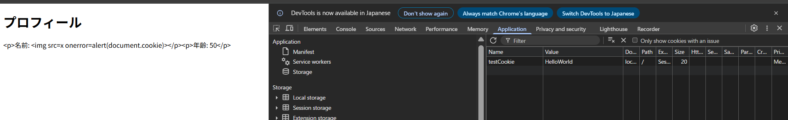

# data.json の改竄例

data.jsonを以下の内容に改竄する。

```js
{
  "name": "",
  "age": 50
}
```

このJSONは、`name` の値として画像ファイルを読み込もうとするが、`src=x`というパスは存在しないためエラーとなり、`onerror`が実行される。`onerror`はユーザーのCookie情報を取得してアラートに表示させる。



# 対処法

`document.innerHTML`を`document.textContent`に変更する。

理由: `document.innerHTML`は入力された文字列がHTMLとして解釈されるが、`document.textContent`は入力された文字列が文字列のまま扱われるためXSSの攻撃スクリプトが無効化されるため。


