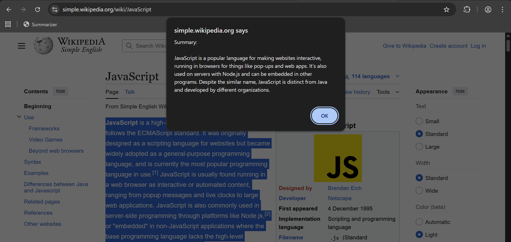

# Chrome 内蔵の Gemini nano を使って選択範囲のテキストを要約する

## 準備

1. https://www.google.com/intl/ja/chrome/dev/ からChrome Devをインストールする。（Gemini nanoはChromeのbeta版やカナリー版でのみ使用可能であるため。）

2. `chrome://flags`をアドレスバーに入力して遷移したChromeの設定画面から2つの設定値を変更する。

   - `Prompt API for Gemini Nano`: Enabled
   - `Enables optimization guide on device`: Enabled BypassPerfRequirement

3. ブックマークレットのURLに以下のコードを入力する。

   `javascript:(async()=>{try{const selection=window.getSelection().toString().trim();if(!selection){alert("Please select some text.");return;}const availability=await Summarizer.availability();if(availability!=="available"&&availability!=="downloadable"){alert("The Summarizer API is not available.");return;}if(!navigator.userActivation.isActive){alert("User activation is required to run summarization.");return;}const summarizer=await Summarizer.create({type:"tldr",format:"plain-text",length:"medium",monitor(m){m.addEventListener("downloadprogress",e=>{console.log(`Downloaded ${Math.round(e.loaded\*100)}%`);});}});const summary=await summarizer.summarize(selection,{context:"This text was selected on a webpage."});alert("Summary:\n\n"+summary);}catch(err){console.error(err);alert("An error occurred while summarizing.");}})();`

   内容は以下の通り。

   ```js
   javascript: (async () => {
     try {
       const selection = window.getSelection().toString().trim();
       if (!selection) {
         alert('Please select some text.');
         return;
       }

       const availability = await Summarizer.availability();
       if (availability !== 'available' && availability !== 'downloadable') {
         alert('The Summarizer API is not available.');
         return;
       }

       if (!navigator.userActivation.isActive) {
         alert('User activation is required to run summarization.');
         return;
       }

       const summarizer = await Summarizer.create({
         type: 'tldr',
         format: 'plain-text',
         length: 'medium',
         monitor(m) {
           m.addEventListener('downloadprogress', (e) => {
             console.log(`Downloaded ${Math.round(e.loaded * 100)}%`);
           });
         },
       });

       const summary = await summarizer.summarize(selection, {
         context: 'This text was selected on a webpage.',
       });

       alert('Summary:\n\n' + summary);
     } catch (err) {
       console.error(err);
       alert('An error occurred while summarizing.');
     }
   })();
   ```

4. 任意のテキストを選択した状態でブックマークレットを押下すると、alertに要約文が表示される。

   注意: 初回実行時はモデルのダウンロードが発生するため、かなり時間がかかる。

## 結果


