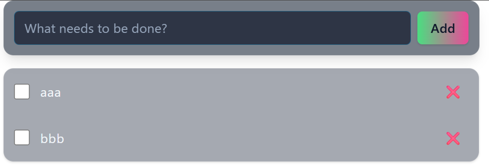

# 1. Tailwind CSS の特徴

## 概要

Tailwind CSS は、オープンソースのCSSフレームワークであり、ユーティリティファースト (あらかじめ定義された小さなクラス（ユーティリティクラス）を組み合わせてスタイルを構築する方法) が採用されている。Bootstrapなどのコンポーネントベースのフレームワークよりデザインの自由度が高く、カスタマイズ性に優れている。

## メリット

- CSS のクラス名を考える必要が無い。ユーティリティクラス名を列挙していくので、何に使用しているのか分からないクラスが大量に発生するようなことが無い。
- 高速に開発が進められる。
- ある程度決まったスタイルのクラスを使うので、プロジェクト全体で似たようなデザインになる。
- CSS ファイルが自動生成されるため、不要なスタイルが含まれず、ファイルサイズが小さくなる。

## デメリット

- CSS の知識が無いと使いこなせない。コンポーネントベースのフレームワークであれば、CSS の知識が無くてもそれっぽいデザインが作れるし、基本的な動作の JavaScript も組み込まれている。
- ユーティリティクラスを覚える必要がある。
- クラス属性部分の記述が長く、HTML が煩雑になることがある。
- 自由度が高すぎるデザインの厳密な再現が難しい。(ピクセル単位で細かくデザインしたい場合は CSS を直接編集した方がよい。)

## 参考

- https://tailwindcss.com/
- https://skillhub.jp/blogs/367

2. スタイル適用結果

