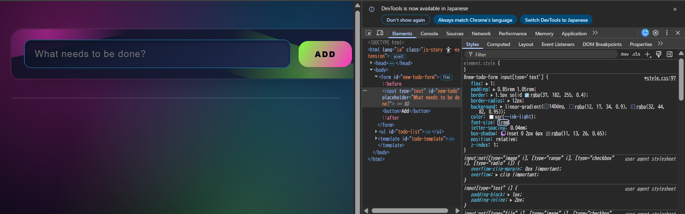
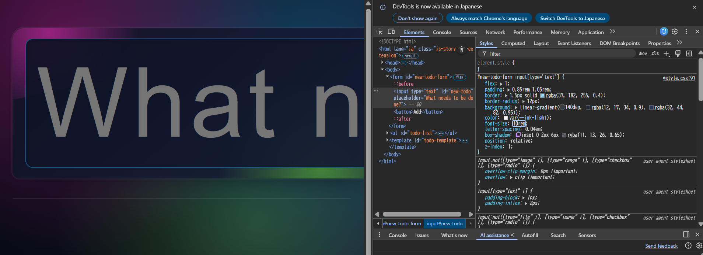
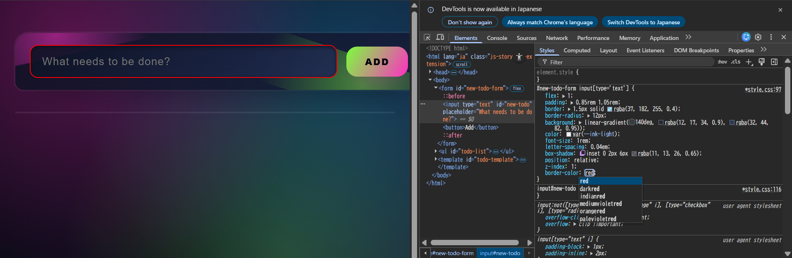
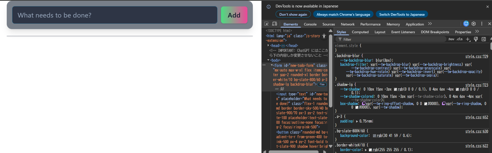
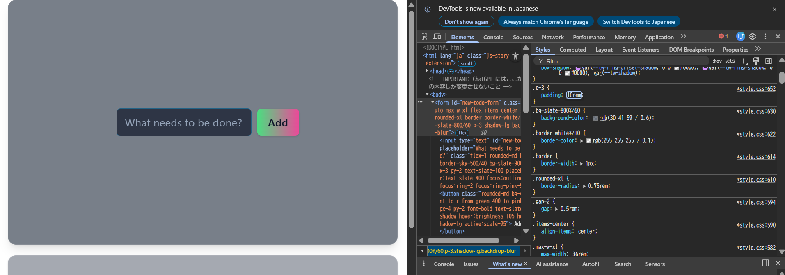
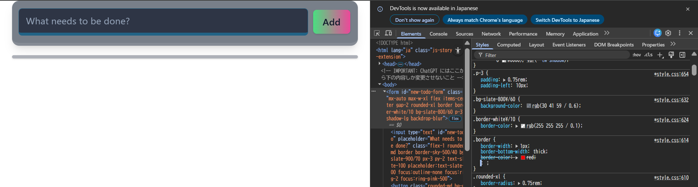
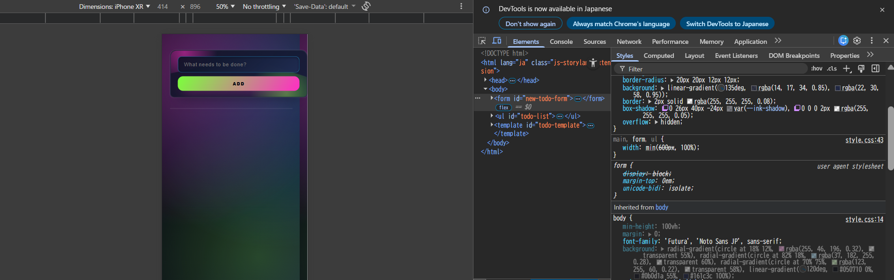
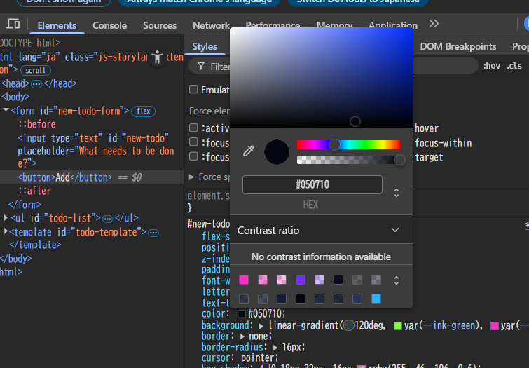
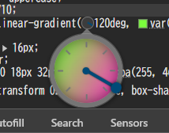
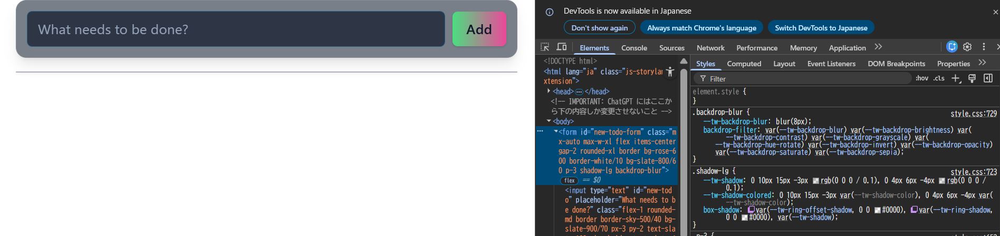

# 課題1

## 15.4-10.1 に対する変更

### 変更前

### 値の変更

入力フォームのプレスホルダーのフォントサイズを10倍に変更したところ、結果が反映された。

### プロパティの追加

入力フォームに対して、 `border-color: red` を追加したところ、結果が反映された。

## 15.4-10.2 に対する変更

### 変更前

### 値の変更

入力フォームの `padding` を 0.75 → 10 に変更したところ、結果が反映された。

### プロパティの追加

入力フォームの枠線の`.border`に対して、`border-bottom-width: thick` を追加したところ、結果が反映された。

# 課題2

1. スマホやタブレットでの CSS の表示を確認できる機能
   

2. Flexbox や Grid レイアウトを変更できる機能
   

3. 属性 の設定値を UI で変更できる機能
   
   

## 参考

https://ics.media/entry/230317/

# 課題3

## 結果

未使用の Tailwind CSS クラスを追加しても、UIに変更が反映されないことを確認した。

## 理由

開発者ツールから HTML の DOM 要素に Tailwind CSS のクラスを追加しても、ファイルシステム上のソースファイルが変更されるわけではない。そのため `style.css` が再ビルドされず、UIにも変更が反映されない。
