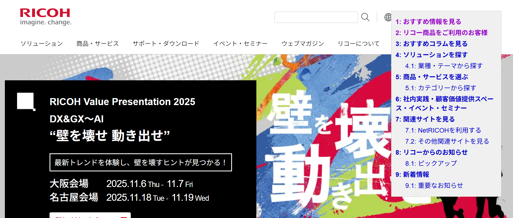
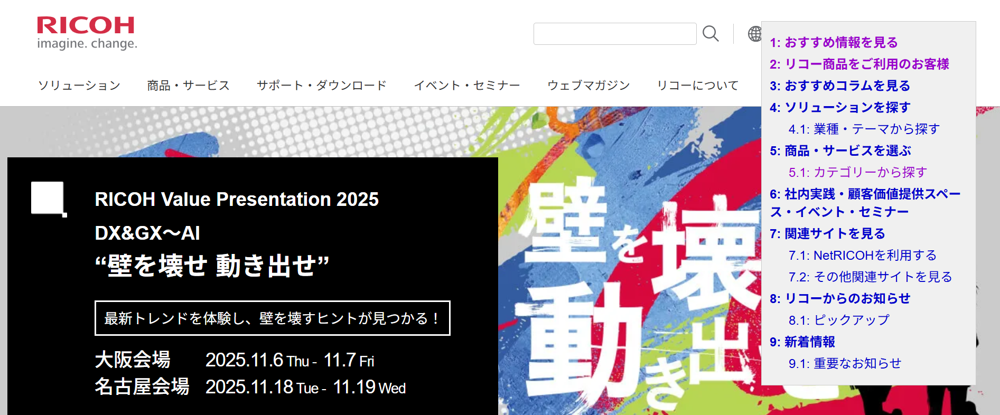

# 課題1

見出し要素 (h2 ~ h6) を全取得して作成された目次リンクが画面右上に表示された。リンク押下時の遷移は即座に画面が切り替わる形である。



# 課題2

ブックマークレットに TOC を登録して実行すると、画面右上に目次リンクが表示された。



# 課題3

以下のコードを追加し、目次選択時に画面がスムーズに遷移することを確認した。

```js
/* スムーズスクロール用のクリックイベント */
link.addEventListener('click', function (e) {
  e.preventDefault();
  /* 対象アンカーを取得 */
  const targetAnchor = document.getElementsByName(fragmentName)[0];
  if (targetAnchor) {
    /* アンカー自体に遷移 */
    targetAnchor.scrollIntoView({ behavior: 'smooth', block: 'start' });
    /* URLの履歴を更新 (戻るボタン押下時に同じページの先頭に戻るようにする) */
    history.replaceState(null, '', `#${fragmentName}`);
  }
});
```
