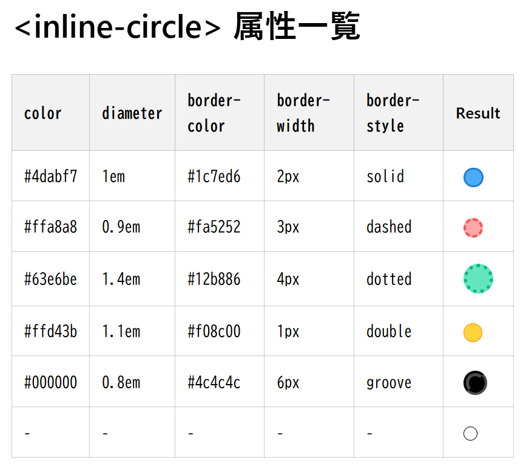
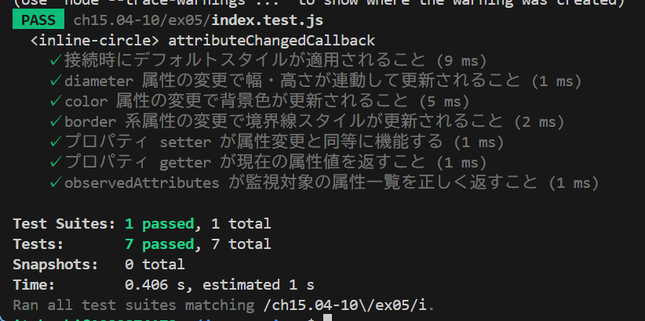

# inline-circle

color diameter 以外に以下の属性を追加した。

- border-color: 円の枠線の色を指定する。デフォルトは black。
- border-width: 円の枠線の太さを指定する。デフォルトは 1px。
- border-style: 円の枠線のスタイルを指定する。デフォルトは solid。

# テスト結果

全てのテストに成功した。

