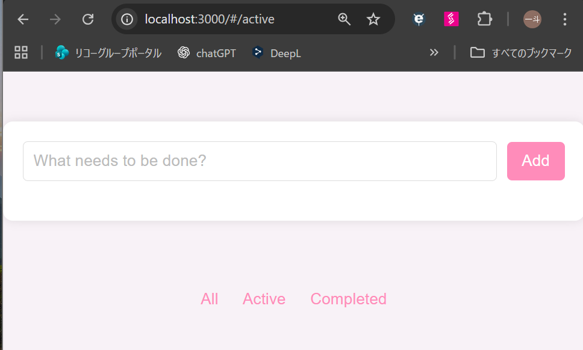
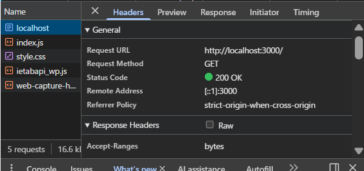
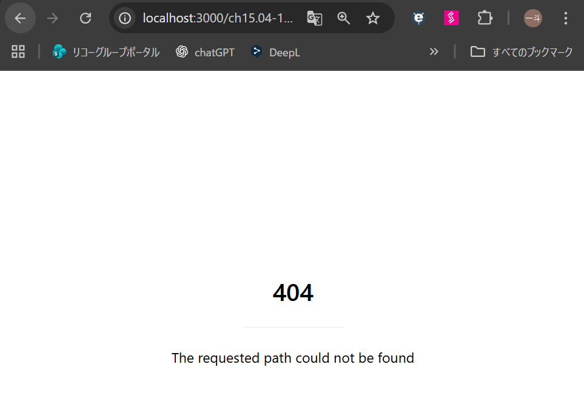
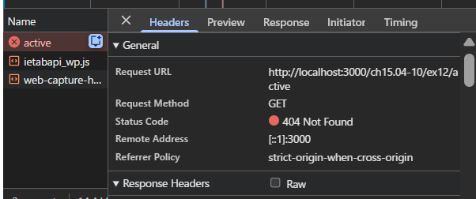
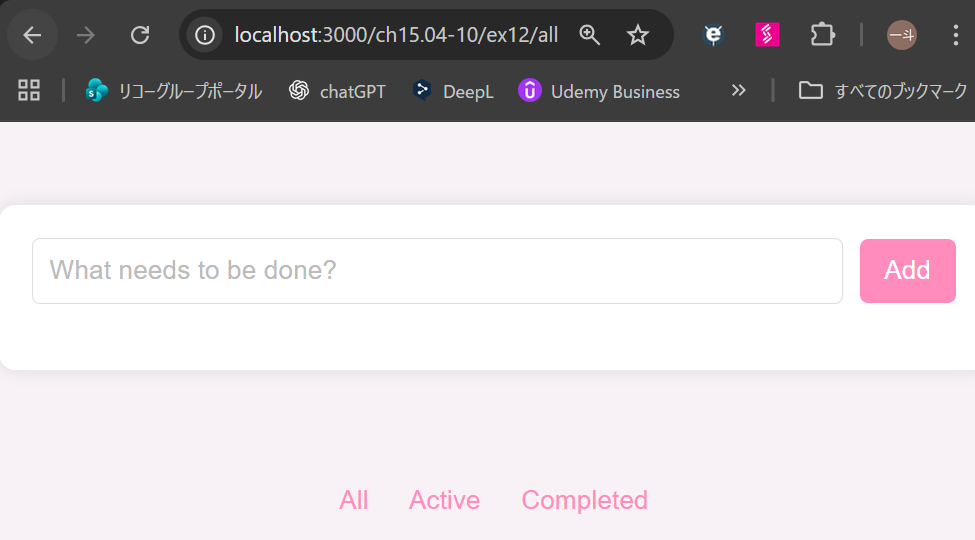
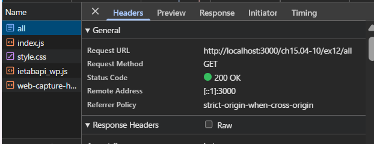

# Active や Completed を選択後にブラウザのリロードを行うとどうなるだろうか。

## hashchange

### 結果

- 登録していた ToDo が消えた初期画面が表示される。
- Active や Completed の選択による URL のハッシュ部分の変更が維持される。



### 理由

- ハッシュ部分を除いた URL (初期 URL) に対して GET リクエストが送信されるため。



## pushState

### 結果

- 404 エラーになり、初期画面が表示されない。
- Active や Completed の選択による URL パス部分の変更が維持される。



### 理由

- Active や Completed を選択した状態の URL に対してGET リクエストが送信されため。
- サーバー側でその URL に対応するリソースが存在しないため 404 エラーになる。



# サーバー側がどのような挙動をすれば pushState を使った実装が期待通り動作するか考えて答えなさい。

## 対策

- すべての URL パスに対して、同じ HTML ファイル (SPA のエントリポイント) を返すようにサーバーを設定する。
- 具体的には、server.js に以下のコードを追加する。

```js
// 直接アクセス時に index.html を返す (pushState で遷移した後のリロード対策)
app.get(/^\/ch15\.04-10\/ex12\/(all|active|completed)$/, (req, res) => {
  res.sendFile(path.join(__dirname, 'index.html'));
});
```

## 結果

- all / active / completed を指定したパスに対しても、同一の HTML ファイルが返却されるようになり、pushState を使用していても SPA が期待通りに動作することが確認できた。



