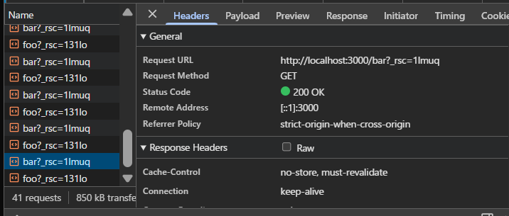
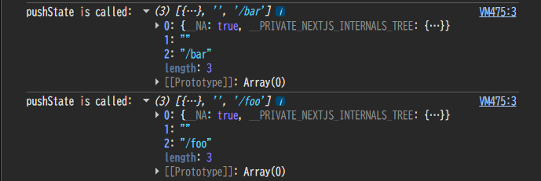
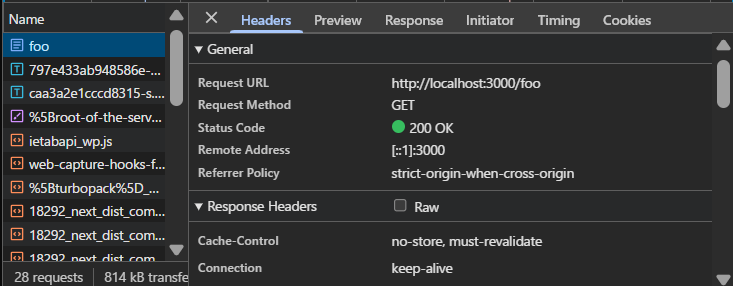

# 1. 以下の動作を確認しなさい

## ブラウザの開発者ツールの「ネットワーク」タブを確認してみよう。リンクをクリックしたときに通信は発生しているだろうか？

- 通信は発生するが、ページ全体のリロードは行われず、差分のみが取得されている。

## pushState はいつ実行されているだろうか？

- リンクをクリックしたときに実行されている。
  

## リロード時に画面の表示はどうなるだろうか？

- リロード時は、現在のパスが /foo の場合は /foo、/bar の場合は /bar の表示が維持される。

  

# 2. 1 で確認した動作と 15.4-10.12 で確認した動作を比較し、next.js の Link でどういった処理が行われているかをまとめなさい。

- Link は pushState を基盤に、プリフェッチ・コード分割・データ取得・スクロール/フォーカス・エラー境界・国際化など多層の副次処理を自動化し、手動実装時の雑務と不整合リスクを排除するラッパーコンポーネントである。
- 15.4-10.12 のような手動で記述する pushState は最低限の履歴操作のみしか実行されないため、周辺機能をすべて自前構築する必要がある。
