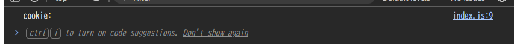
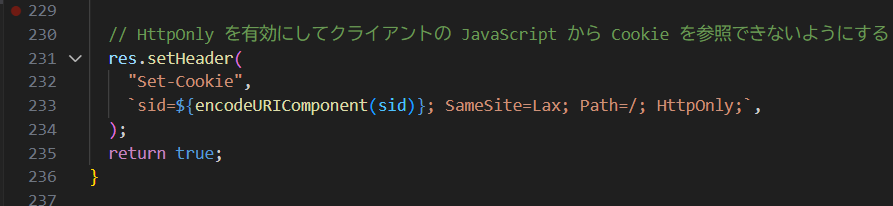
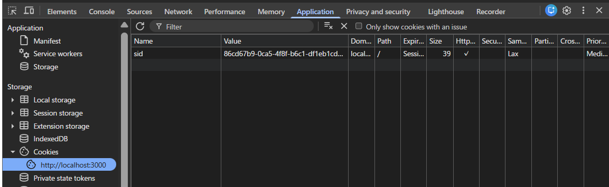
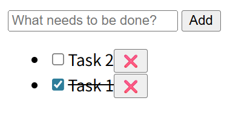
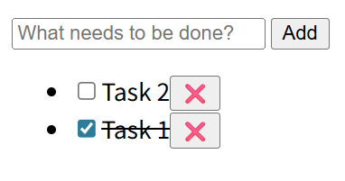
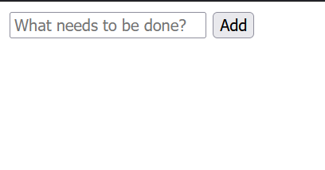
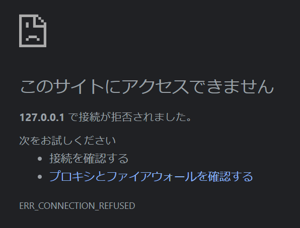

# 2. このサーバでは Cookie を使ってクライアントのセッションを識別し、タスク一覧をセッションごとに分離して管理する簡易的な認証/認可を行っている。サーバが設定している Cookie の値は `sid=<セッションに一意に割り当てた ID>; SameSite=Lax; Path=/; HttpOnly;` である。ToDo アプリでいくつかのタスクを作成した後、以下に挙げる操作を実施したとき、それぞれどのような結果になるか記載し、その理由を説明しなさい。

## 1. index.js で `document.cookie` プロパティを `console.log` で表示する

**結果**: Cookie が表示されなかった。

**理由**: サーバーが設定している Cookie には `HttpOnly` 属性が付与されており、JavaScript の `document.cookie` からアクセスできないようになっているため。（XSS によるセッション情報の盗難防止対策）

## 2. ブラウザの開発者コンソールで http://localhost:3000/ の Cookie を表示する

**結果**: Cookie が表示された。

**理由**: ブラウザの開発者ツールは、クライアントサイドで保存されるデータに対するアクセス権を有するので、`HttpOnly` 属性が付いた Cookie も含めて全ての Cookie を表示できるため。

## 3. ToDo アプリのタブをリロードする

**結果**: 作成したタスクが全て表示された。

**理由**: リロードしても同一ブラウザの同一オリジンなので、Cookie が保持されるため。サーバーは Cookie の `sid` 値を元にセッションを識別し、そのセッションに紐付いたタスク一覧を返すため、以前作成したタスクが全て表示される。

## 4. 同一ブラウザの異なるタブやウィンドウで http://localhost:3000/ を開いて ToDo リストの状態を確認する

**結果**: 同じタスク一覧が表示された。

**理由**: Cookie はオリジンごとに保存され、同一オリジンであれば同じブラウザの全てのタブ・ウィンドウで共有されるため。

## 5. シークレットウィンドウや異なるブラウザで http://localhost:3000/ を開いて ToDo リストの状態を確認する

**結果**: 作成済みのタスク一覧が表示されなかった。

**理由**: シークレットウィンドウや異なるブラウザでは独立した Cookie ストレージを持つのでCookie が共有されず、新しいセッション ID が割り当てられて、新規のタスク一覧として扱われるため。

## 6. http://127.0.0.1:3000/ を開いて ToDo リストの状態を確認する

**結果**: アクセスが拒否されたため検証できなかった。

**予想**: 作成済みのタスク一覧は表示されない。

**理由**: ループバックアドレスでは localhost と同じ IP アドレスへアクセスされるものの、オリジンとしては異なるので、Cookie が送信されず、新しいセッションとして扱われると考えられるため。
