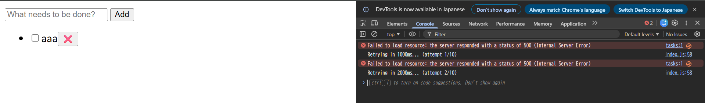
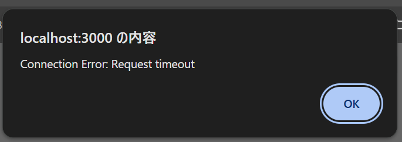

## 正常なレスポンス の場合

正常に処理が成功した。

## ステータスコードが 500 のエラーレスポンス の場合

Exponential Backoff で指数関数的に待機時間を延長しながらリトライが行われた。

## レスポンスは正常だが、レスポンスを返すまでに 60 秒かかる 場合

処理中はフォームの入力欄と送信ボタン、チェックボックス、削除ボタンが無効化され、レスポンス受信後に再度有効化された。

リクエスト創出から3 秒以上経過した場合にエラーメッセージが `alert` で表示された。

