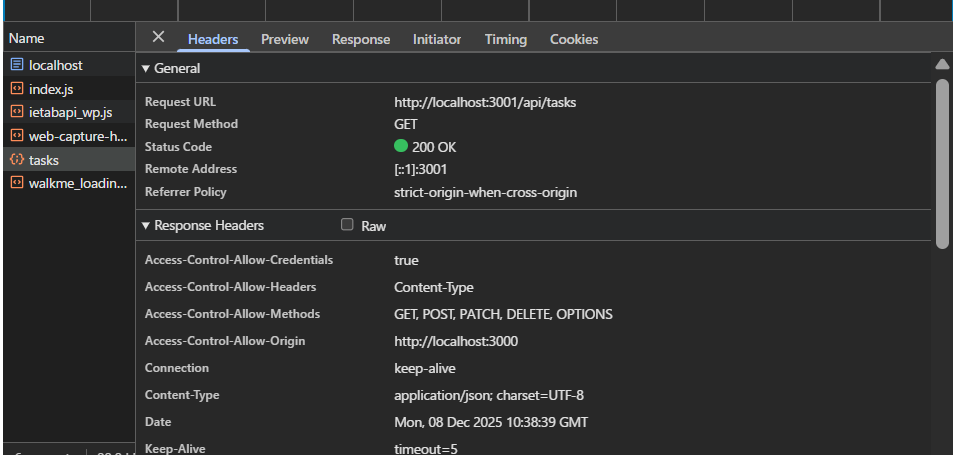

# 解答

## `contents/index.js` で、`fetch` のオプション設定を変更し、CORS モードでのリクエスト送信と、クロスオリジンでの Cookie の送信を許可する

```js
// GET /api/tasks でタスク一覧を取得
const response = await fetch('http://localhost:3001/api/tasks', {
  mode: 'cors',
  credentials: 'include',
});
```

## `server.js` で以下の箇所を変更して、`http://localhost:3000` からのクロスオリジンリクエストを許可する

```js
// CORS のヘッダを返すミドルウェア
function corsMiddleware(_url, _req, res) {
  // TODO: CORS に必要なヘッダを複数設定する
  // クロスオリジンリクエストを許可するために必要なヘッダを設定
  // Access-Control-Allow-Origin: リクエストを許可するオリジンを指定
  res.setHeader('Access-Control-Allow-Origin', 'http://localhost:3000');
  // Access-Control-Allow-Methods: 許可するHTTPメソッドを指定
  res.setHeader(
    'Access-Control-Allow-Methods',
    'GET, POST, PATCH, DELETE, OPTIONS'
  );
  // Access-Control-Allow-Headers: 許可するリクエストヘッダーを指定
  res.setHeader('Access-Control-Allow-Headers', 'Content-Type');
  // Access-Control-Allow-Credentials: クロスオリジンでのCookie送信を許可 (この設定がないとリロード時などにセッションが引き継がれなくなる。)
  res.setHeader('Access-Control-Allow-Credentials', 'true');
  return true;
}
```

```js
http
  .createServer(async function (req, res) {
    await routes(
      // TODO: この行のコメントを外す
      // Preflight リクエスト（OPTIONS）を処理
      ['OPTIONS', '/api/*', nopHandler, cors],
      ['GET', '/api/tasks', listTasksHandler, authz, cors],
      ['GET', '/api/tasks/{id}', getTaskHandler, authz, cors],
      ['POST', '/api/tasks', createTaskHandler, authz, cors],
      ['PATCH', '/api/tasks/{id}', patchTaskHandler, authz, cors],
      ['DELETE', '/api/tasks/{id}', deleteTaskHandler, authz, cors]
    )(req, res);
  })
  .listen(3001);
```

# 結果

異なるオリジン間での通信に成功していることが実際の挙動と開発者ツールのヘッダーから確認できた。


