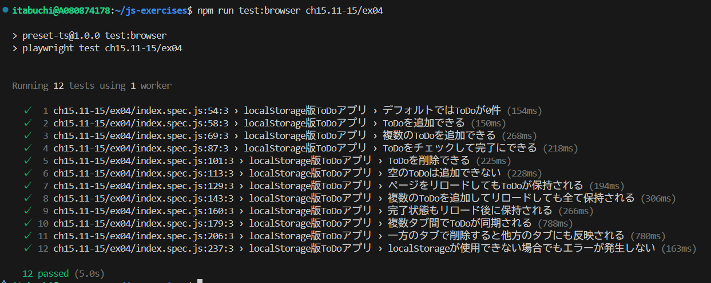
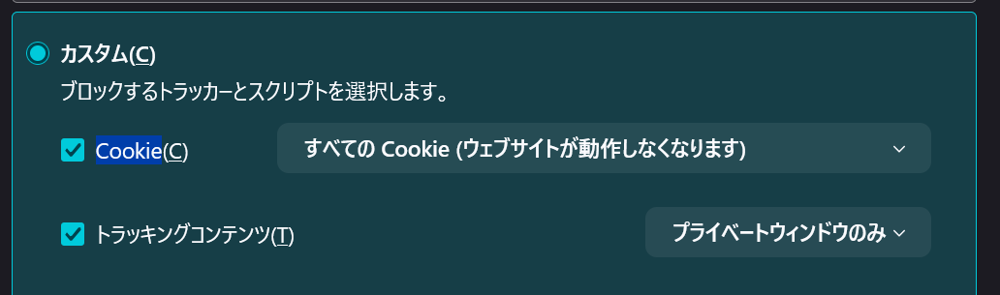
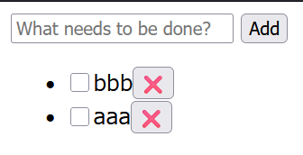

# テスト結果

全てのテストに成功することを確認した。



# ブラウザの設定で、localStorage の利用を禁止にしてもエラーが発生せず、そのタブを開いている間だけは正常に動くようにしなさい。localStorage で実現していた機能は動かなくても構わない。(Firefox ではすべての Cookie を拒絶すると禁止にできる)

## 変更点

localStorage が利用可能かチェックする関数を作成し、利用不可能な場合はアーリーリターンするように実装した。

```js
// localStorage が利用可能かチェックする関数
function isLocalStorageAvailable() {
  try {
    const test = '__localStorage_availability_test__';
    localStorage.setItem(test, test);
    localStorage.removeItem(test);
    return true;
  } catch (e) {
    return false;
  }
}
```

```js
if (!isLocalStorageAvailable()) return;
```

## 結果

firefox で全ての Cookie をブロックした状態（localStorage の利用を禁止した状態）でもエラーが発生せず、そのタブを開いている間だけは正常に動くことを確認した。



