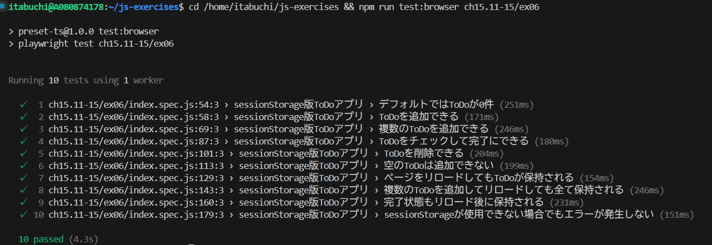

# テスト実行結果

全てのテストに成功することを確認した。

# localStorage と sessionStorage それぞれに保存されたデータの有効期限がどのように異なるか、実際に動作確認して結果を記述しなさい。

## データの有効期限

| 操作                             | localStorage             | sessionStorage             |
| -------------------------------- | ------------------------ | -------------------------- |
| **ページをリロード**             | データ保持               | データ保持                 |
| **タブを閉じる**                 | データ保持               | データ削除                 |
| **ブラウザを完全に閉じる**       | データ保持               | データ削除                 |
| **PCを再起動**                   | データ保持               | データ削除                 |
| **新しいタブで同じページを開く** | データ共有（同期される） | データ共有されない（独立） |
| **明示的に削除**                 | データ削除               | データ削除                 |

## 使い分けの指針

localStorage は長期間のデータ保存、sessionStorage は一時的なデータ保存に向いている。

| 用途                                         | localStorage | sessionStorage |
| -------------------------------------------- | ------------ | -------------- |
| **ユーザーの設定やテーマを保存**             | ✓            | ×              |
| **オフライン時のデータキャッシュ**           | ✓            | ×              |
| **一時的なユーザー入力の保存**               | ×            | ✓              |
| **ウィザード形式のステップごとのデータ保存** | ×            | ✓              |
