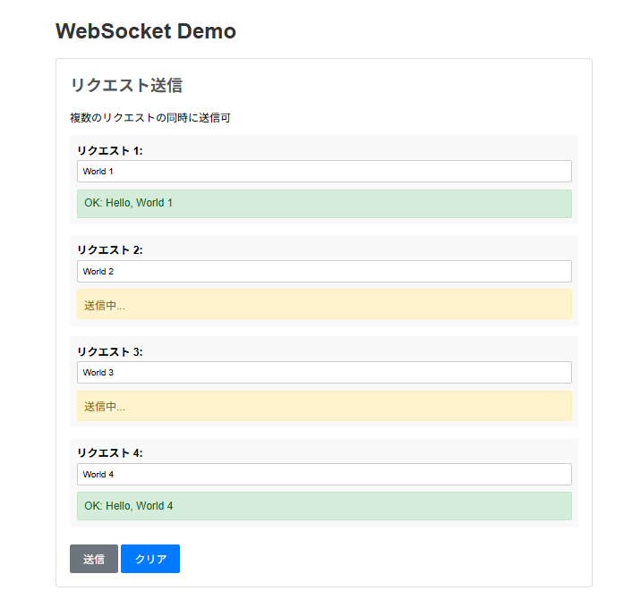
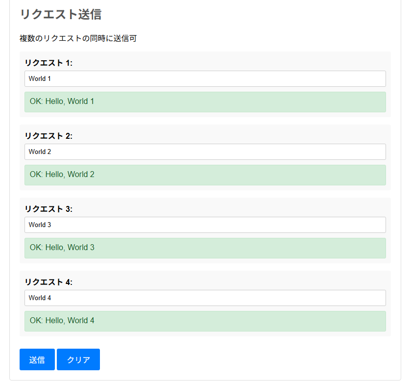
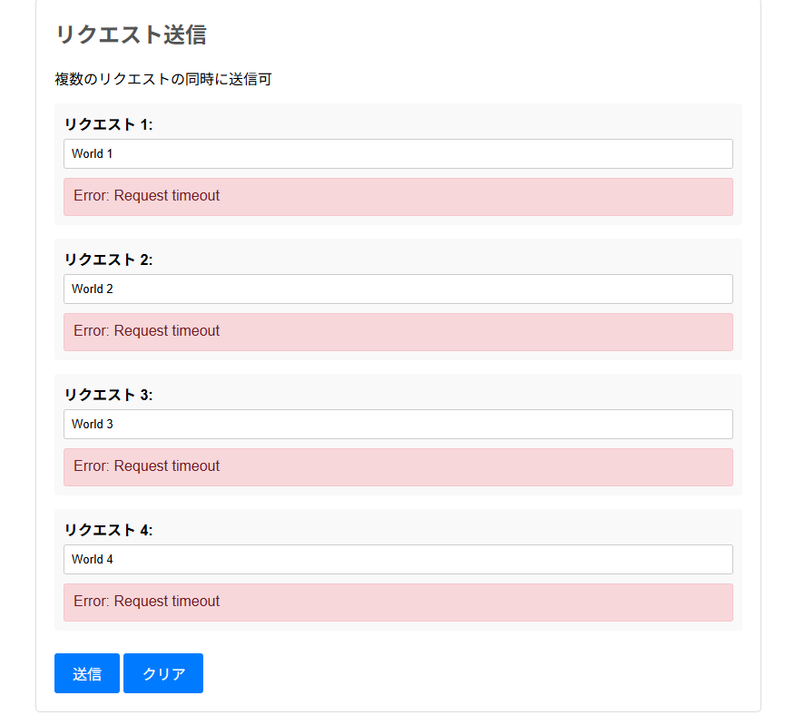

# 実装チェックリスト

## 1. WebSocket サーバに文字列データを含むリクエストメッセージを送信する sendRequest 関数を実装しなさい。

- [〇] 引数としてリクエスト本文を受け取り、返り値としてレスポンス本文が得られる Promise<string> を返すこと。
- [〇] 一定時間内にレスポンスを受信したら、Promise が resolve されること。
- [〇] 一定時間経過時にタイムアウトし、Promise が reject されること。
- [〇] WebSocket の接続が切断した場合、Promise が reject されること。
- [〇] 送信するメッセージの形式は、リクエストが複数並行して送信されてもよいよう考慮すること

## 2. 1.とは別の WebSocket 接続で、WebSocket サーバから転送されたリクエストメッセージを受信してレスポンスを返す実装をしなさい。

- [〇] レスポンス本文は、 リクエスト本文の先頭に Hello, を付加したものを返すこと。
- [〇] どのリクエストに対するレスポンスか、リクエストした側で判別できるようにすること。

## 3. 1., 2. を利用してリクエストの送信とレスポンスの確認が可能な Web ページを作成しなさい

- [〇] リクエスト本文の入力欄を複数用意し、ボタン押下時に sendRequest 関数でを同時にリクエストを送信するできるようにすること。
- [〇] 時間内にレスポンスが返った場合はレスポンス本文を、エラーまたはタイムアウトが発生した場合はその内容を、対応するリクエスト入力欄の横または下に表示すること。

---

# 実行

## 手順

1. node ch15.11-15/ex08/server.js を実行し、WebSocket サーバーを起動する。
2. npm run server ch15.11-15/ex08 を実行し、ブラウザでクライアントを開く。

## 結果

複数同時リクエストの送信とレスポンス受信が可能であることを確認した。

- 送信時

- レスポンス受信時

タイムアウト時間を 10 秒から 1 秒に変更し、タイムアウト動作を確認した。

- タイムアウト時

