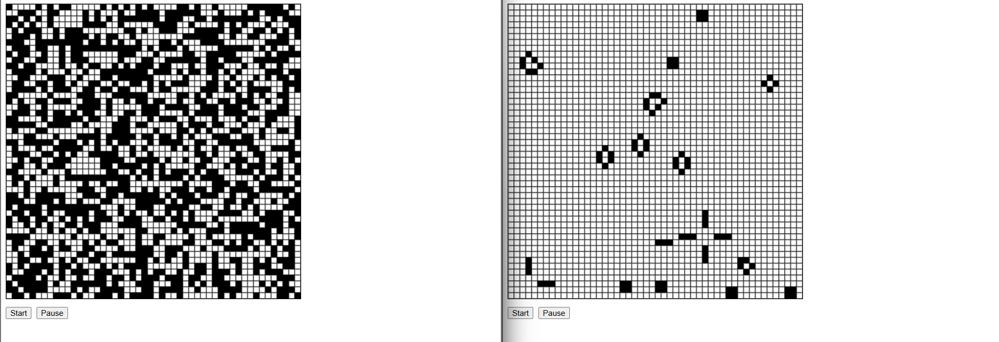
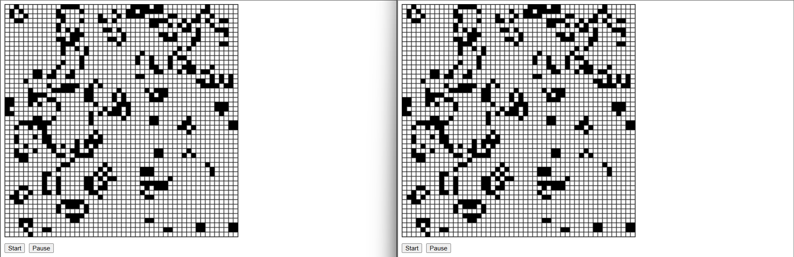

# 15.4-10.10 で作成したライフゲーム

## 手順

npm run server ch15.04-10/ex10 を実行し、ブラウザでクライアントを開く。

## 結果

ライフゲームを左右の画面で同時に開き、右画面のゲームだけを起動したところ、同期されずに右画面だけが動作した。

# 15.11-15.09 で作成した Web Socket 版ライフゲーム

## 手順

1. node ch15.11-15/ex09/server.js を実行し、WebSocket サーバーを起動する。
2. npm run server ch15.11-15/ex09 を実行し、ブラウザでクライアントを開く。

## 結果

- ライフゲームを左右の画面で同時に開き、右画面のゲームだけを起動したところ、同期されずに右画面だけが動作した。
- 画面クリック、Start, Pauseの動作も同期されることを確認した。
- 画面更新や新規タブでの接続を行っても、同期されることを確認した。

