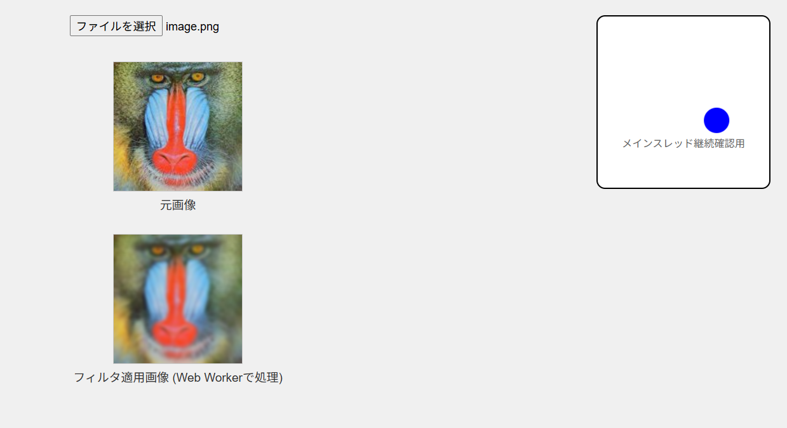

# 使用画像

[神奈川工科大学 情報学部 情報処理工学科 信号処理応用研究室 標準画像/サンプルデータ](http://www.ess.ic.kanagawa-it.ac.jp/app_images_j.html)

Mandrill


# メインスレッド継続確認用アニメーション

Web Workerを使用しても、メインスレッドがブロックされていないことを確認するために、画面右上にアニメーションを追加した。

```js
  #animation-demo {
        position: fixed;
        top: 20px;
        right: 20px;
        width: 200px;
        height: 200px;
        background-color: white;
        border: 2px solid black;
        border-radius: 10px;
        display: flex;
        align-items: center;
        justify-content: center;
        flex-direction: column;
      }

      #moving-ball {
        width: 30px;
        height: 30px;
        background-color: blue;
        border-radius: 50%;
        position: absolute;
        left: 50%;
        top: 50%;
        margin-left: -15px;
        margin-top: -15px;
        animation: circular 3s linear infinite;
      }

      @keyframes circular {
        0% {
          transform: translate(60px, 0px);
        }
        25% {
          transform: translate(0px, 60px);
        }
        50% {
          transform: translate(-60px, 0px);
        }
        75% {
          transform: translate(0px, -60px);
        }
        100% {
          transform: translate(60px, 0px);
        }
      }

      #animation-demo p {
        margin-top: 100px;
        color: #666;
        font-size: 12px;
      }
```

# 実行結果

- Web Workerを使用して、ガウシアンフィルタを適用できていることを確認した。
- 画像処理中もアニメーションが動作していることを確認した。


