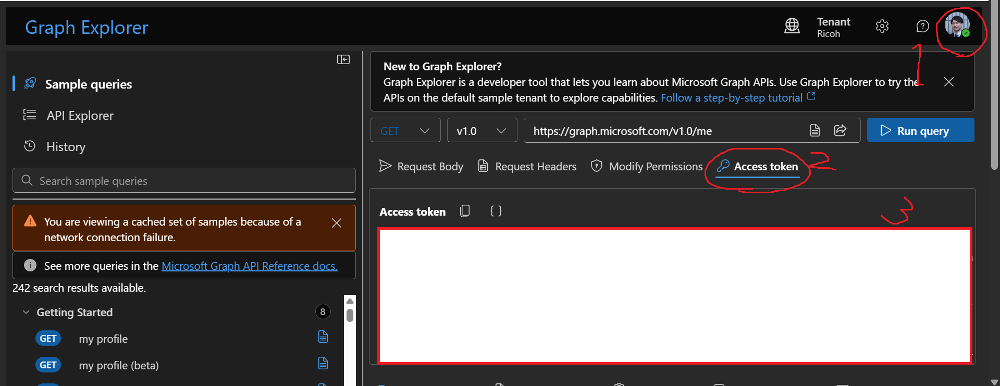
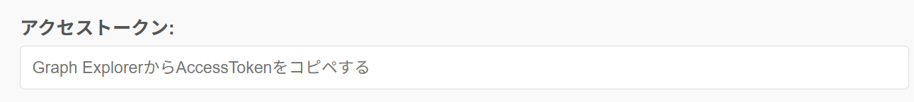
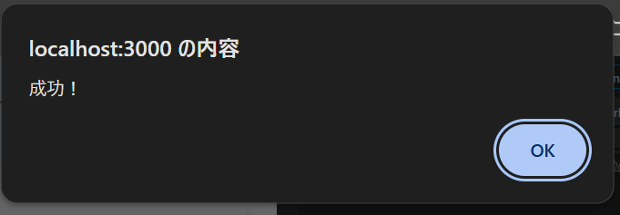

# 手順

"https://developer.microsoft.com/en-us/graph/graph-explorer"にアクセスし、以下の手順でアクセスキーを取得する。

1. Microsoftアカウントでサインインする。
2. "Access token" タブを押下する。
3. トークンをコピーする。

4. コピーしたトークンを Web アプリのフォームに貼り付ける。

# 実行結果

画像ファイルを選択してアップロードを行った。

自分の OneDrive 上にファイルがアップロードされていることを確認した。

